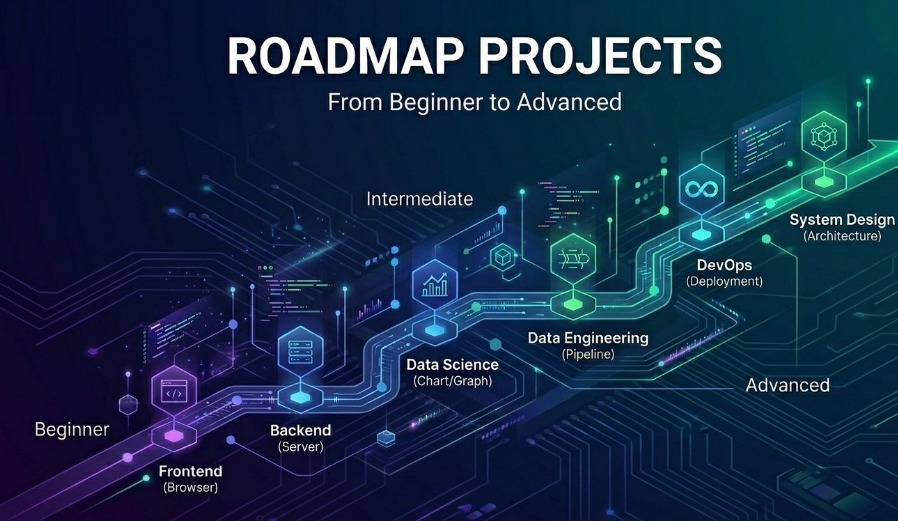

# Roadmap Projects

A comprehensive learning resource featuring 180 curated project ideas organized across six technology domains. This repository is designed to help developers of all levels structure their learning journey through hands-on practice.

## About This Repository

This collection contains **180 project ideas** distributed across:
- **6 Technology Domains**: Backend, Frontend, Data Science, Data Engineering, DevOps, and System Design
- **3 Difficulty Levels**: Beginner, Intermediate, and Advanced
- **10 Projects per Category**: Each domain and level combination contains 10 carefully selected projects

All projects are **idea-focused** with implementation guidance, learning objectives, and key challenges—without explicit code. This approach lets you learn by doing while building problem-solving skills.

## Explore by Domain

### Backend Development
Build robust server applications, APIs, and business logic. Learn about architecture, databases, authentication, and scalability.

[Explore Backend Projects →](./projects/backend/README.md)

### Frontend Development
Create beautiful user interfaces and interactive web experiences. Master UI frameworks, state management, and user experience design.

[Explore Frontend Projects →](./projects/frontend/README.md)

### Data Science
Transform data into insights through analysis, visualization, and machine learning. Build predictive models and data pipelines.

[Explore Data Science Projects →](./projects/data-science/README.md)

### Data Engineering
Design and maintain data infrastructure. Master ETL processes, data warehousing, and streaming architectures.

[Explore Data Engineering Projects →](./projects/data-engineering/README.md)

### DevOps
Automate deployments, manage infrastructure, and ensure system reliability. Learn CI/CD, containerization, and monitoring.

[Explore DevOps Projects →](./projects/devops/README.md)

### System Design
Design large-scale distributed systems. Tackle scalability, reliability, and performance challenges of real-world applications.

[Explore System Design Projects →](./projects/system-design/README.md)

## Learning Path

### Progressive Structure

Each domain is organized into three levels:

- **Beginner** (2-8 hours): Build foundational understanding with small, focused projects
- **Intermediate** (1-3 days): Integrate multiple concepts and work with real-world patterns
- **Advanced** (1-2 weeks+): Design and architect complex systems with enterprise considerations

### How to Use This Repository

1. **Choose a Domain**: Pick the technology area you want to explore
2. **Select Your Level**: Start with beginner projects or jump to your current skill level
3. **Read the Project Brief**: Each project has a comprehensive README with:
   - Project idea and overview
   - Learning objectives to achieve
   - Implementation tips and guidance
   - Key challenges to overcome
4. **Build It Your Way**: Use your preferred tech stack and tools
5. **Extend and Improve**: Enhance projects with additional features and optimizations

## Who This Is For

- **Students**: Structured practice with real-world concepts
- **Self-taught Developers**: Guided learning without traditional education
- **Career Changers**: Build portfolio projects while learning new domains
- **Bootcamp Graduates**: Reinforce concepts with practical projects
- **Educators**: Source of assignment ideas and learning materials
- **Interview Preparation**: Practice system design and problem-solving

## Project Guidelines

### Time Investment
- Beginner projects typically take 2-8 hours
- Intermediate projects: 1-3 days of focused work
- Advanced projects: 1-2 weeks or more depending on scope

### Technology Agnostic
Projects are designed to work with any technology stack. Choose what you're comfortable with:
- **Backend**: Node.js, Python, Java, Go, Ruby, PHP
- **Frontend**: React, Vue, Angular, Svelte, vanilla JavaScript
- **Data**: Python (pandas, scikit-learn), R, Julia, Scala
- **DevOps**: Kubernetes, Docker, Terraform, AWS, GCP, Azure

### Learning Focus
Each project emphasizes understanding concepts over memorizing syntax. The goal is to build problem-solving skills transferable across technologies.

## Getting Started

1. Browse the six domains above
2. Open a domain's README to see all 30 projects (beginner, intermediate, advanced)
3. Click on a project folder to read its detailed README
4. Start implementing with your preferred tools and approach

## Contributing

We welcome contributions! If you'd like to add new projects or improve existing ones:

1. Read [CONTRIBUTING.md](./CONTRIBUTING.md)
2. Fork the repository
3. Create a feature branch
4. Submit a pull request with your improvements

## License

This project is licensed under the MIT License. See [LICENSE](./LICENSE) for details.

## Support

If this repository has been helpful:
- Star the project to show support
- Share it with others learning to code
- Report issues or suggest improvements
- Contribute new project ideas

---

**Happy learning! Pick a domain and start building.**
