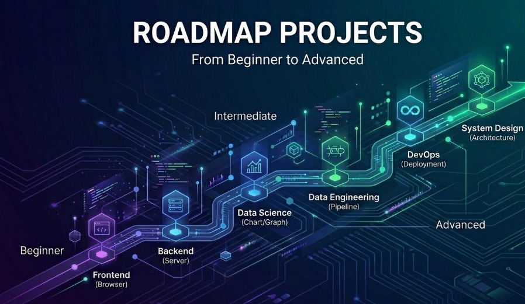

# Roadmap Projects

> 🌐 [English](./README.md) · **Português**



<p align="center">
  
  
  
  
  
</p>

**180 desafios práticos** em seis domínios de tecnologia e três níveis de
dificuldade — cada um escrito como **exercício guiado**, não como solução pronta.
Você recebe o *o quê* e o *porquê*, além de marcos e esboços de dados; **o código é
você quem escreve.**

## Índice

- [Por que este repositório](#por-que-este-repositório)
- [Domínios](#domínios)
- [Como os projetos são estruturados](#como-os-projetos-são-estruturados)
- [Níveis de dificuldade](#níveis-de-dificuldade)
- [Como usar este repositório](#como-usar-este-repositório)
- [Para quem é](#para-quem-é)
- [Contribuindo](#contribuindo)
- [Licença](#licença)

## Por que este repositório

Tutoriais entregam a resposta. Este repositório entrega um problema bem definido e
a estrutura para você mesmo resolvê-lo — do jeito que o trabalho real de engenharia
aparece. Cada descrição diz o que construir, por que importa, como dividir em
marcos e como saber que terminou, deixando a implementação por sua conta.

## Domínios

| Domínio | O que você constrói | Projetos |
|---|---|---|
| [Backend](./projects/backend/README.md) | APIs, autenticação, filas, serviços distribuídos | 30 |
| [Frontend](./projects/frontend/README.md) | UIs, estado, tempo real, performance, a11y | 30 |
| [Data Science](./projects/data-science/README.md) | EDA, modelagem, NLP, pipelines de ML | 30 |
| [Data Engineering](./projects/data-engineering/README.md) | ETL, streaming, data warehouses, data lakes | 30 |
| [DevOps](./projects/devops/README.md) | CI/CD, containers, IaC, observabilidade | 30 |
| [System Design](./projects/system-design/README.md) | Arquiteturas escaláveis do mundo real | 30 |

Cada domínio tem **10 iniciantes + 10 intermediários + 10 avançados**.

## Como os projetos são estruturados

```text
projects/<domínio>/<nível>/NN-<slug>/
  README.md         # descrição em inglês
  README.pt-BR.md   # mesma descrição em português
```

Toda descrição segue uma estrutura consistente: **Visão Geral · Pré-requisitos ·
Objetivos de Aprendizado · Requisitos Funcionais · Marcos Sugeridos · Esboço de
Dados e Interface · Desafios Extras · Definição de Pronto · Armadilhas Comuns ·
Recursos.**

## Níveis de dificuldade

- **Iniciante** (2–8 horas): um conceito central, poucas dependências.
- **Intermediário** (1–3 dias): vários conceitos juntos, ferramentas reais.
- **Avançado** (1–2 semanas+): arquitetura, escalabilidade e trade-offs de confiabilidade.

## Como usar este repositório

1. **Escolha um domínio** que combine com o que você quer aprender.
2. **Escolha um nível** com honestidade — comece onde você será desafiado, não sufocado.
3. **Leia a descrição** inteira antes de escrever qualquer código.
4. **Construa marco a marco** na stack que preferir.
5. **Confira a Definição de Pronto** e depois vá para os Desafios Extras.

> Independente de tecnologia: use qualquer linguagem ou framework. As descrições
> definem comportamento e contratos, não uma stack obrigatória.

## Para quem é

Estudantes, desenvolvedores autodidatas, quem está mudando de carreira, egressos
de bootcamp, educadores em busca de atividades e quem se prepara para entrevistas
com prática de verdade.

## Contribuindo

Contribuições são bem-vindas — novos projetos, correções e traduções. Comece por
[CONTRIBUTING.pt-BR.md](./CONTRIBUTING.pt-BR.md) e pelo
[template de projeto](./.github/PROJECT_TEMPLATE.pt-BR.md). Mantenha as descrições
como exercícios guiados e as duas versões de idioma em sincronia.

## Licença

Distribuído sob a [Licença MIT](./LICENSE).

---

**Escolha um domínio e comece a construir.**
