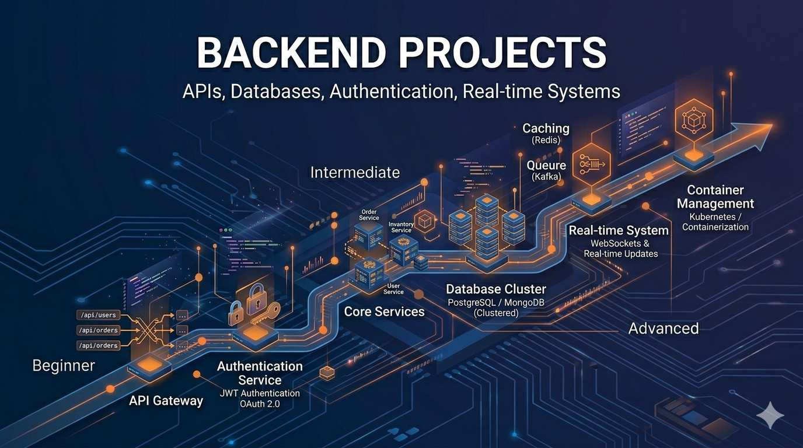

# Backend Development Projects

Master the art of building robust server applications, APIs, and distributed systems. Backend projects focus on architecture, data persistence, scalability, and real-world patterns that power modern applications.

## What You'll Learn

Backend development encompasses:
- **REST & API Design**: Building scalable APIs and microservices
- **Databases & Data Management**: SQL, NoSQL, and data modeling
- **Authentication & Security**: User management, JWT, OAuth
- **Scalability Patterns**: Caching, load balancing, message queues
- **System Architecture**: Microservices, event-driven systems, distributed transactions
- **DevOps Integration**: Deployment, monitoring, and operations

---

## Beginner Projects (10 Projects)

Start with foundational backend concepts through simple, focused applications.

| # | Project | Description |
|---|---------|-------------|
| 1 | [Simple REST API for Task Management](./beginner/01-simple-rest-api-task-management/) | Build a basic REST API to manage tasks with CRUD operations |
| 2 | [URL Shortener (In-Memory)](./beginner/02-url-shortener-in-memory/) | Create a service that shortens URLs and stores mappings in memory |
| 3 | [Basic Authentication API](./beginner/03-basic-authentication-api/) | Implement simple user login with hardcoded credentials |
| 4 | [Notes API with File Persistence](./beginner/04-notes-api-file-persistence/) | Build an API that saves notes to the file system |
| 5 | [Weather Proxy API](./beginner/05-weather-proxy-api/) | Create an API wrapper around an external weather service |
| 6 | [CLI User Manager](./beginner/06-cli-user-manager/) | Build a command-line tool to manage user data |
| 7 | [File Upload API](./beginner/07-file-upload-api/) | Implement file upload functionality with local storage |
| 8 | [Basic Logging System](./beginner/08-basic-logging-system/) | Create a simple logging service for application events |
| 9 | [Static JSON API Server](./beginner/09-static-json-api-server/) | Build a minimal API server serving static JSON data |
| 10 | [Email Sender Mock Service](./beginner/10-email-sender-mock-service/) | Create a service that simulates sending emails |

---

## Intermediate Projects (10 Projects)

Integrate multiple concepts and work with real-world backend patterns.

| # | Project | Description |
|---|---------|-------------|
| 1 | [E-commerce API with JWT](./intermediate/01-ecommerce-api-jwt/) | Build a product catalog API with JWT authentication |
| 2 | [Blog Platform with CRUD + Comments](./intermediate/02-blog-platform-crud-comments/) | Create a blog engine with posts, comments, and user management |
| 3 | [Rate-Limited API with Redis](./intermediate/03-rate-limited-api-redis/) | Implement API rate limiting using Redis caching |
| 4 | [Job Queue System](./intermediate/04-job-queue-system/) | Build a background job processor with queues |
| 5 | [Multi-Tenant SaaS API](./intermediate/05-multi-tenant-saas-api/) | Design an API serving multiple isolated customer tenants |
| 6 | [API with Caching Layer](./intermediate/06-api-caching-layer/) | Add Redis caching to improve API performance |
| 7 | [Payment Processing Mock Service](./intermediate/07-payment-processing-mock/) | Create a mock payment gateway with transaction handling |
| 8 | [Notification Service](./intermediate/08-notification-service/) | Build a service sending emails and SMS with retry logic |
| 9 | [API Gateway](./intermediate/09-api-gateway/) | Implement a gateway for routing and managing APIs |
| 10 | [GraphQL API with Resolvers](./intermediate/10-graphql-api-resolvers/) | Build a GraphQL server with efficient data fetching |

---

## Advanced Projects (10 Projects)

Design and architect complex systems with enterprise considerations.

| # | Project | Description |
|---|---------|-------------|
| 1 | [Distributed Order Processing System](./advanced/01-distributed-order-processing/) | Design a high-availability order system with multiple services |
| 2 | [Event-Driven Microservices Architecture](./advanced/02-event-driven-microservices/) | Build a system of services communicating via events |
| 3 | [High-Scale Authentication Service](./advanced/03-high-scale-auth-oauth2/) | Create an authentication service handling millions of users |
| 4 | [Real-Time Chat Backend](./advanced/04-realtime-chat-websockets/) | Build a chat server with WebSocket connections |
| 5 | [Feature Flag Service](./advanced/05-feature-flag-service/) | Implement a system for managing feature toggles |
| 6 | [Observability Platform](./advanced/06-observability-platform/) | Build a logging, metrics, and tracing infrastructure |
| 7 | [Resilient API with Circuit Breaker](./advanced/07-resilient-api-circuit-breaker/) | Design fault-tolerant APIs with circuit breaker patterns |
| 8 | [Multi-Region API Design](./advanced/08-multi-region-api/) | Architect APIs deployed across multiple geographic regions |
| 9 | [Streaming Platform Backend](./advanced/09-streaming-platform-backend/) | Build backend for a Netflix-like video service |
| 10 | [Idempotent Financial Transactions](./advanced/10-idempotent-transactions/) | Design systems handling financial operations safely |

---

## Learning Path

### Timeline & Progression

**Beginner Phase**: 2-4 weeks
- Learn HTTP basics and REST principles
- Understand routing, middleware, and request handling
- Work with in-memory storage before databases
- Implement simple authentication

**Intermediate Phase**: 4-8 weeks
- Integrate with real databases (SQL and NoSQL)
- Implement proper authentication (JWT, OAuth)
- Add caching layers for performance
- Learn about API design and versioning

**Advanced Phase**: 2-3 months
- Design distributed systems
- Implement microservices patterns
- Handle scalability and reliability
- Build observability and monitoring

### Recommended Tech Stacks

#### By Language

**JavaScript/Node.js**
- Express, Fastify, NestJS
- PostgreSQL, MongoDB
- Redis, RabbitMQ

**Python**
- Django, Flask, FastAPI
- PostgreSQL, SQLAlchemy
- Celery, Redis

**Java**
- Spring Boot, Quarkus
- PostgreSQL, Hibernate
- Apache Kafka, RabbitMQ

**Go**
- Gin, Echo, Chi
- PostgreSQL, Mongodb
- gRPC, Protocol Buffers

### Key Concepts to Master

1. **API Design**: RESTful principles, GraphQL, gRPC
2. **Databases**: SQL fundamentals, indexing, query optimization
3. **Authentication**: Sessions, JWT, OAuth2
4. **Caching**: In-memory caches, cache invalidation strategies
5. **Message Queues**: Background jobs, event streaming
6. **Testing**: Unit tests, integration tests, API testing
7. **Deployment**: Containerization, orchestration, CI/CD

---

## Tips for Success

1. **Start Small**: Master one concept deeply before moving to the next
2. **Use Real Databases**: Move beyond in-memory storage quickly
3. **Build APIs First**: Start with endpoints before adding complexity
4. **Practice Security**: Implement authentication/authorization early
5. **Monitor Everything**: Add logging and monitoring from the beginning
6. **Scale Gradually**: Understand performance bottlenecks before optimizing

---

## Resources

- [REST API Best Practices](https://restfulapi.net/)
- [Database Design Fundamentals](https://www.postgresql.org/docs/)
- [API Documentation Standards](https://swagger.io/)
- [System Design Primer](https://github.com/donnemartin/system-design-primer)
- [Backend Development Roadmap](https://roadmap.sh/backend)

---

## Next Steps

1. Choose a beginner project and read its README
2. Set up your development environment
3. Implement the project using your preferred tech stack
4. Extend it with additional features
5. Move to the next project when completed

**Ready to start? Pick a project from the list above and begin building!**
