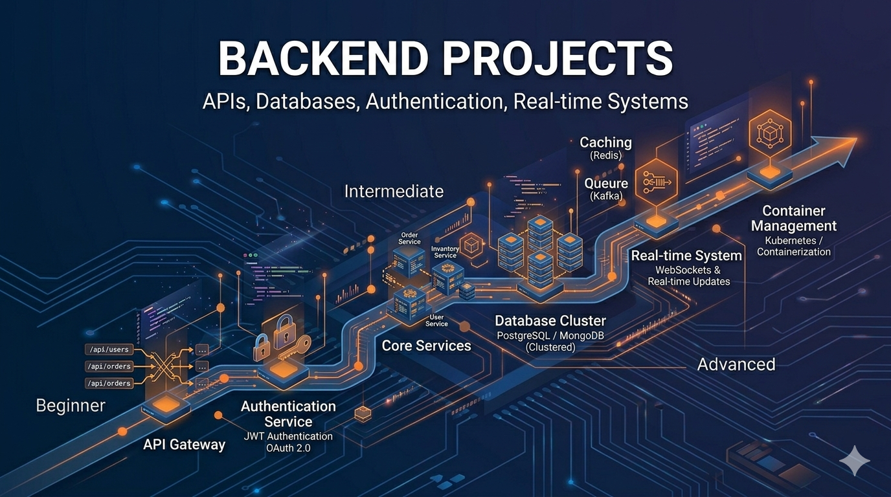

> 🌐 **English** · [Português](./README.pt-BR.md)

# Backend Development Projects

Build the server side of real applications: APIs, authentication, data
persistence, message queues, and distributed services. These are guided
exercises — you get the *what* and the *why*, then you write the code.

> Every project has both an English (`README.md`) and a Portuguese
> (`README.pt-BR.md`) brief.

## What You'll Build

- REST and GraphQL APIs with clean, versioned contracts
- Authentication and authorization flows (sessions, JWT, OAuth2)
- Background job processors and event-driven services
- Caching layers, rate limiters, and resilient integrations
- Distributed systems with observability and fault tolerance

## What You'll Learn

- **API design**: RESTful principles, GraphQL, gRPC
- **Data management**: SQL/NoSQL modeling, indexing, transactions
- **Security**: password hashing, token flows, tenant isolation
- **Scalability**: caching, queues, load balancing, sharding
- **Reliability**: retries, idempotency, circuit breakers, monitoring

## Beginner Projects (10 Projects)

Foundational backend concepts through small, focused services.

| # | Project | Description |
|---|---------|-------------|
| 1 | [Simple REST API for Task Management](./beginner/01-simple-rest-api-task-management/) | Build a basic REST API to manage tasks with CRUD operations |
| 2 | [URL Shortener (In-Memory)](./beginner/02-url-shortener-in-memory/) | Create a service that shortens URLs and stores mappings in memory |
| 3 | [Basic Authentication API](./beginner/03-basic-authentication-api/) | Implement simple user login with hardcoded credentials |
| 4 | [Notes API with File Persistence](./beginner/04-notes-api-file-persistence/) | Build an API that saves notes to the file system |
| 5 | [Weather Proxy API](./beginner/05-weather-proxy-api/) | Create an API wrapper around an external weather service |
| 6 | [CLI User Manager](./beginner/06-cli-user-manager/) | Build a command-line tool to manage user data |
| 7 | [File Upload API](./beginner/07-file-upload-api/) | Implement file upload functionality with local storage |
| 8 | [Basic Logging System](./beginner/08-basic-logging-system/) | Create a simple logging service for application events |
| 9 | [Static JSON API Server](./beginner/09-static-json-api-server/) | Build a minimal API server serving static JSON data |
| 10 | [Email Sender Mock Service](./beginner/10-email-sender-mock-service/) | Create a service that simulates sending emails |

## Intermediate Projects (10 Projects)

Multiple concepts combined into real-world backend patterns.

| # | Project | Description |
|---|---------|-------------|
| 1 | [E-commerce API with JWT](./intermediate/01-ecommerce-api-jwt/) | Build a product catalog API with JWT authentication |
| 2 | [Blog Platform with CRUD + Comments](./intermediate/02-blog-platform-crud/) | Create a blog engine with posts, comments, and user management |
| 3 | [Rate-Limited API with Redis](./intermediate/03-rate-limited-api-redis/) | Implement API rate limiting using Redis caching |
| 4 | [Job Queue System](./intermediate/04-job-queue-rabbitmq/) | Build a background job processor with queues |
| 5 | [Multi-Tenant SaaS API](./intermediate/05-multi-tenant-saas-api/) | Design an API serving multiple isolated customer tenants |
| 6 | [API with Caching Layer](./intermediate/06-api-caching-redis/) | Add Redis caching to improve API performance |
| 7 | [Payment Processing Mock Service](./intermediate/07-payment-mock-service/) | Create a mock payment gateway with transaction handling |
| 8 | [Notification Service](./intermediate/08-notification-service/) | Build a service sending emails and SMS with retry logic |
| 9 | [API Gateway](./intermediate/09-api-gateway/) | Implement a gateway for routing and managing APIs |
| 10 | [GraphQL API with Resolvers](./intermediate/10-graphql-api/) | Build a GraphQL server with efficient data fetching |

## Advanced Projects (10 Projects)

Architect complex systems with enterprise-grade concerns.

| # | Project | Description |
|---|---------|-------------|
| 1 | [Distributed Order Processing System](./advanced/01-distributed-order-system/) | Design a high-availability order system with multiple services |
| 2 | [Event-Driven Microservices Architecture](./advanced/02-event-driven-microservices/) | Build a system of services communicating via events |
| 3 | [High-Scale Authentication Service](./advanced/03-oauth2-auth-service/) | Create an authentication service handling millions of users |
| 4 | [Real-Time Chat Backend](./advanced/04-realtime-chat-websockets/) | Build a chat server with WebSocket connections |
| 5 | [Feature Flag Service](./advanced/05-feature-flag-service/) | Implement a system for managing feature toggles |
| 6 | [Observability Platform](./advanced/06-observability-platform/) | Build a logging, metrics, and tracing infrastructure |
| 7 | [Resilient API with Circuit Breaker](./advanced/07-resilient-api-circuit-breaker/) | Design fault-tolerant APIs with circuit breaker patterns |
| 8 | [Multi-Region API Design](./advanced/08-multi-region-api/) | Architect APIs deployed across multiple geographic regions |
| 9 | [Streaming Platform Backend](./advanced/09-streaming-platform-backend/) | Build backend for a Netflix-like video service |
| 10 | [Idempotent Financial Transactions](./advanced/10-idempotent-financial-transactions/) | Design systems handling financial operations safely |

## Learning Path

- **Beginner (2–4 weeks)**: HTTP and REST basics, routing and middleware,
  in-memory storage, simple auth.
- **Intermediate (4–8 weeks)**: real databases, JWT/OAuth, caching layers,
  API versioning and design.
- **Advanced (2–3 months)**: distributed systems, microservices, scalability,
  observability, and reliability trade-offs.

Work top to bottom within a level before moving up — each tier assumes the
previous one.

## Key Concepts

1. **API design** — REST, GraphQL, gRPC contracts
2. **Databases** — schema design, indexing, query optimization
3. **Authentication** — sessions, JWT, OAuth2
4. **Caching** — invalidation strategies, read-through/write-through
5. **Messaging** — background jobs, pub/sub, event streaming
6. **Resilience** — retries, idempotency, circuit breakers
7. **Testing** — unit, integration, and contract tests

## Resources

- [REST API Best Practices](https://restfulapi.net/)
- [PostgreSQL Documentation](https://www.postgresql.org/docs/)
- [OpenAPI / Swagger](https://swagger.io/)
- [System Design Primer](https://github.com/donnemartin/system-design-primer)
- [Backend Developer Roadmap](https://roadmap.sh/backend)

## Next Steps

1. Pick a beginner project and read its brief end to end.
2. Set up your environment in whatever stack you prefer.
3. Build it milestone by milestone.
4. Check the Definition of Done, then attempt the stretch goals.

**Pick a project and start building.**
