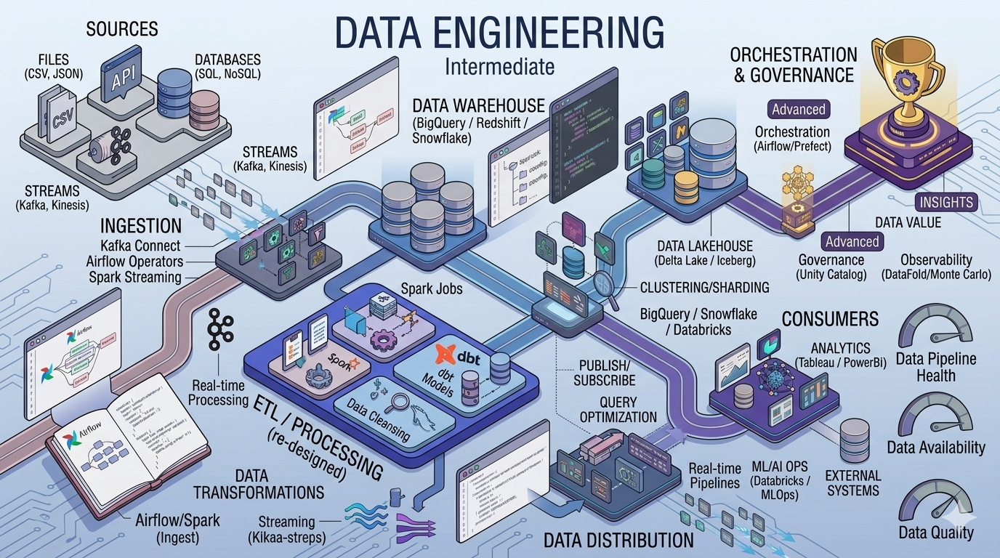

# Data Engineering Projects

Design and maintain the infrastructure that moves, transforms, and stores data at scale. Data engineering projects focus on pipelines, data warehousing, streaming architectures, and data infrastructure.

## What You'll Learn

Data engineering encompasses:
- **ETL/ELT Processes**: Extracting, transforming, and loading data
- **Data Pipelines**: Building automated data workflows
- **Databases**: SQL and NoSQL design and optimization
- **Data Warehousing**: Building data repositories for analytics
- **Streaming**: Real-time data processing architectures
- **Cloud Platforms**: AWS, GCP, Azure data services
- **Infrastructure as Code**: Automating infrastructure management
- **Scalability**: Handling data growth and performance
- **Data Quality**: Validation, monitoring, and governance

---

## Beginner Projects (10 Projects)

Start with foundational data engineering concepts through focused tasks.

| # | Project | Description |
|---|---------|-------------|
| 1 | [CSV to Database Loader](./beginner/01-csv-to-database/) | Load CSV data into a SQL database |
| 2 | [Simple ETL Pipeline](./beginner/02-simple-etl-pipeline/) | Extract, transform, and load data from one source to another |
| 3 | [Data Validation Script](./beginner/03-data-validation/) | Validate data quality with checks and rules |
| 4 | [Log Parser](./beginner/04-log-parser/) | Parse and structure log files for analysis |
| 5 | [API to CSV Exporter](./beginner/05-api-to-csv-exporter/) | Fetch API data and export to CSV |
| 6 | [Batch Processing Script](./beginner/06-batch-processing/) | Process large datasets in batches |
| 7 | [File Ingestion System](./beginner/07-file-ingestion/) | Build a system for ingesting multiple file types |
| 8 | [Data Cleaning Pipeline](./beginner/08-data-cleaning-pipeline/) | Create reusable data cleaning workflows |
| 9 | [JSON Transformer](./beginner/09-json-transformer/) | Transform JSON data into different formats |
| 10 | [Basic Scheduler](./beginner/10-basic-scheduler/) | Schedule and run data tasks automatically |

---

## Intermediate Projects (10 Projects)

Integrate multiple concepts and work with real-world data engineering patterns.

| # | Project | Description |
|---|---------|-------------|
| 1 | [ETL Pipeline with Airflow](./intermediate/01-etl-airflow/) | Build orchestrated data pipelines with Apache Airflow |
| 2 | [Data Warehouse Loader](./intermediate/02-data-warehouse-loader/) | Load data into a data warehouse system |
| 3 | [Streaming Pipeline with Kafka](./intermediate/03-streaming-kafka/) | Process real-time data streams with Kafka |
| 4 | [Data Lake Ingestion System](./intermediate/04-data-lake-ingestion/) | Build data lake infrastructure for raw data storage |
| 5 | [Schema Evolution System](./intermediate/05-schema-evolution/) | Handle changing data schemas in pipelines |
| 6 | [Incremental Data Processing](./intermediate/06-incremental-processing/) | Process only new/changed data efficiently |
| 7 | [Pipeline Monitoring System](./intermediate/07-pipeline-monitoring/) | Monitor and alert on pipeline health |
| 8 | [Data Quality Framework](./intermediate/08-data-quality-framework/) | Build comprehensive data validation framework |
| 9 | [Multi-Source Ingestion](./intermediate/09-multi-source-ingestion/) | Combine data from multiple sources |
| 10 | [Partitioned Data Pipeline](./intermediate/10-partitioned-pipeline/) | Build efficient partitioned data processing |

---

## Advanced Projects (10 Projects)

Design and architect complex data infrastructure with enterprise considerations.

| # | Project | Description |
|---|---------|-------------|
| 1 | [Real-Time Data Platform](./advanced/01-realtime-data-platform/) | Build end-to-end real-time data infrastructure |
| 2 | [Distributed ETL System](./advanced/02-distributed-etl/) | Scale ETL across multiple machines and clusters |
| 3 | [Data Mesh Simulation](./advanced/03-data-mesh-simulation/) | Implement decentralized data architecture |
| 4 | [Scalable Data Lake Architecture](./advanced/04-scalable-data-lake/) | Design data lake for massive scale |
| 5 | [CDC Pipeline](./advanced/05-cdc-pipeline/) | Implement change data capture from source systems |
| 6 | [Data Lineage System](./advanced/06-data-lineage/) | Track data flow and dependencies across pipelines |
| 7 | [High-Throughput Streaming](./advanced/07-high-throughput-streaming/) | Process millions of events per second |
| 8 | [Cost-Optimized Pipeline](./advanced/08-cost-optimized-pipeline/) | Build efficient pipelines minimizing cloud costs |
| 9 | [Multi-Region Replication](./advanced/09-multi-region-replication/) | Replicate data across geographic regions |
| 10 | [Self-Healing Pipelines](./advanced/10-self-healing-pipelines/) | Build automated recovery mechanisms |

---

## Learning Path

### Timeline & Progression

**Beginner Phase**: 3-4 weeks
- Learn SQL fundamentals and relational databases
- Understand ETL concepts and data flow
- Build simple data pipelines and loaders
- Work with CSV and JSON data

**Intermediate Phase**: 6-8 weeks
- Learn pipeline orchestration tools (Airflow)
- Understand data warehousing concepts
- Implement streaming with Kafka
- Add monitoring and validation

**Advanced Phase**: 2-3 months
- Design distributed systems
- Build scalable data architectures
- Implement advanced patterns (data mesh, CDC)
- Optimize for cost and performance

### Recommended Tech Stacks

#### Core Tools

**Data Storage**
- PostgreSQL, MySQL (relational)
- MongoDB, Cassandra (NoSQL)
- Elasticsearch (search/analytics)

**Pipeline Tools**
- Apache Airflow (orchestration)
- dbt (transformation)
- Apache Spark (distributed processing)

**Streaming**
- Apache Kafka (pub/sub messaging)
- Apache Flink (stream processing)
- RabbitMQ (message queues)

**Cloud Platforms**
- AWS: Glue, EMR, S3, Redshift
- GCP: Dataflow, BigQuery, Pub/Sub
- Azure: Data Factory, Synapse, Event Hubs

### Key Concepts to Master

1. **SQL**: Queries, optimization, indexing, transactions
2. **ETL Design**: Extract, transform, load patterns
3. **Data Modeling**: Schema design, dimensional modeling
4. **Scalability**: Partitioning, sharding, distribution
5. **Reliability**: Error handling, retry logic, idempotency
6. **Performance**: Query optimization, caching, incremental loads
7. **Monitoring**: Alerting, logging, metrics
8. **Data Quality**: Validation, reconciliation, governance

---

## Tips for Success

1. **Start with SQL**: Master relational databases before NoSQL
2. **Build for Reliability**: Make pipelines fault-tolerant from day one
3. **Monitor Early**: Add observability to every pipeline
4. **Test Your Data**: Validate inputs and outputs rigorously
5. **Design for Scalability**: Think about future data volumes early
6. **Document Your Pipelines**: Make them understandable to others
7. **Optimize Incrementally**: Profile before optimizing
8. **Version Your Code**: Track pipeline changes like any software

---

## Common Mistakes to Avoid

- Ignoring data quality validation
- Building monolithic pipelines that are hard to maintain
- Not monitoring pipeline performance and health
- Failing to handle late-arriving data
- Neglecting security and access controls
- Optimizing prematurely without understanding bottlenecks
- Lack of error handling and retry logic
- Not documenting data lineage and dependencies

---

## Resources

- [SQL Tutorial](https://www.postgresql.org/docs/current/tutorial.html)
- [Apache Airflow Documentation](https://airflow.apache.org/)
- [dbt Documentation](https://docs.getdbt.com/)
- [Apache Spark Guide](https://spark.apache.org/docs/latest/)
- [The Data Warehouse Toolkit](https://www.kimballgroup.com/)
- [Data Engineering Roadmap](https://roadmap.sh/data-engineer)
- [Fundamentals of Data Engineering (Book)](https://www.oreilly.com/library/view/fundamentals-of-data/9781098108298/)

---

## Real-World Scenarios

- Building ETL for business data integration
- Ingesting IoT sensor data at scale
- Real-time analytics on streaming data
- Data warehouse for BI reporting
- Data lake for data science teams
- Event streaming for microservices
- Multi-source data consolidation

---

## Next Steps

1. Learn SQL fundamentals with a relational database
2. Choose a beginner project and read its README
3. Implement using Python or your preferred language
4. Start with small data volumes and scale gradually
5. Add monitoring and validation from the start
6. Progress to intermediate projects

**Ready to build data infrastructure? Pick a project and start engineering!**
