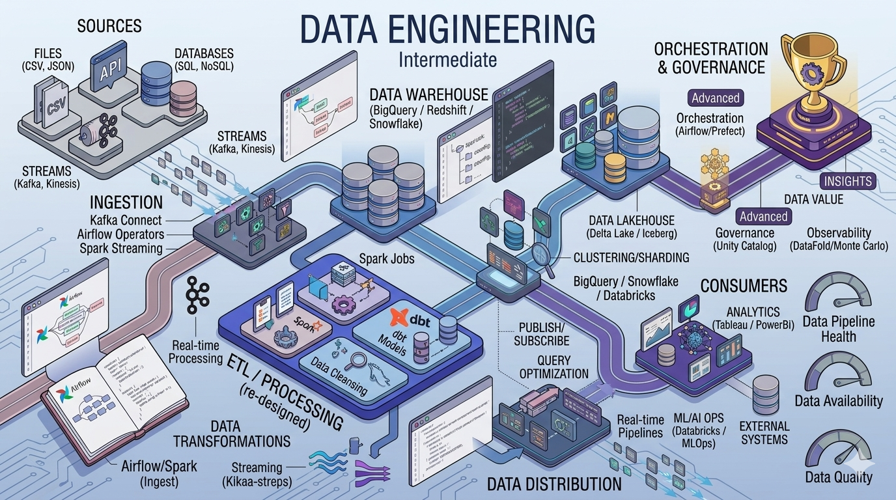

> 🌐 **English** · [Português](./README.pt-BR.md)

# Data Engineering Projects

Build the infrastructure that moves, transforms, and stores data reliably at
scale: ETL/ELT pipelines, streaming, warehouses, and data lakes. These are
guided exercises — you get the *what* and the *why*, then you write the code.

> Every project has both an English (`README.md`) and a Portuguese
> (`README.pt-BR.md`) brief.

## What You'll Build

- Batch ETL pipelines and file ingestion systems
- Orchestrated workflows with schedulers like Airflow
- Streaming pipelines with Kafka and real-time processing
- Data warehouses, data lakes, and CDC pipelines
- Distributed, cost-optimized, self-healing infrastructure

## What You'll Learn

- **ETL/ELT**: extract, transform, load patterns
- **Orchestration**: DAGs, scheduling, dependencies
- **Streaming**: pub/sub, windowing, exactly-once semantics
- **Modeling**: dimensional modeling, schema evolution
- **Reliability**: idempotency, retries, monitoring, data quality

## Beginner Projects (10 Projects)

Foundational data engineering concepts through focused tasks.

| # | Project | Description |
|---|---------|-------------|
| 1 | [CSV to Database Loader](./beginner/01-csv-to-database/) | Load CSV data into a SQL database |
| 2 | [Simple ETL Pipeline](./beginner/02-simple-etl/) | Extract, transform, and load data from one source to another |
| 3 | [Data Validation Script](./beginner/03-data-validation/) | Validate data quality with checks and rules |
| 4 | [Log Parser](./beginner/04-log-parser/) | Parse and structure log files for analysis |
| 5 | [API to CSV Exporter](./beginner/05-api-to-csv/) | Fetch API data and export to CSV |
| 6 | [Batch Processing Script](./beginner/06-batch-processing/) | Process large datasets in batches |
| 7 | [File Ingestion System](./beginner/07-file-ingestion/) | Build a system for ingesting multiple file types |
| 8 | [Data Cleaning Pipeline](./beginner/08-data-cleaning/) | Create reusable data cleaning workflows |
| 9 | [JSON Transformer](./beginner/09-json-transformer/) | Transform JSON data into different formats |
| 10 | [Basic Scheduler](./beginner/10-basic-scheduler/) | Schedule and run data tasks automatically |

## Intermediate Projects (10 Projects)

Multiple concepts combined into real-world data engineering patterns.

| # | Project | Description |
|---|---------|-------------|
| 1 | [ETL Pipeline with Airflow](./intermediate/01-airflow-etl/) | Build orchestrated data pipelines with Apache Airflow |
| 2 | [Data Warehouse Loader](./intermediate/02-data-warehouse-loader/) | Load data into a data warehouse system |
| 3 | [Streaming Pipeline with Kafka](./intermediate/03-streaming-kafka/) | Process real-time data streams with Kafka |
| 4 | [Data Lake Ingestion System](./intermediate/04-data-lake-ingestion/) | Build data lake infrastructure for raw data storage |
| 5 | [Schema Evolution System](./intermediate/05-schema-evolution/) | Handle changing data schemas in pipelines |
| 6 | [Incremental Data Processing](./intermediate/06-incremental-processing/) | Process only new/changed data efficiently |
| 7 | [Pipeline Monitoring System](./intermediate/07-pipeline-monitoring/) | Monitor and alert on pipeline health |
| 8 | [Data Quality Framework](./intermediate/08-data-quality/) | Build comprehensive data validation framework |
| 9 | [Multi-Source Ingestion](./intermediate/09-multi-source-ingestion/) | Combine data from multiple sources |
| 10 | [Partitioned Data Pipeline](./intermediate/10-partitioned-pipeline/) | Build efficient partitioned data processing |

## Advanced Projects (10 Projects)

Architect complex data infrastructure with enterprise-grade concerns.

| # | Project | Description |
|---|---------|-------------|
| 1 | [Real-Time Data Platform](./advanced/01-real-time-platform/) | Build end-to-end real-time data infrastructure |
| 2 | [Distributed ETL System](./advanced/02-distributed-etl/) | Scale ETL across multiple machines and clusters |
| 3 | [Data Mesh Simulation](./advanced/03-data-mesh/) | Implement decentralized data architecture |
| 4 | [Scalable Data Lake Architecture](./advanced/04-data-lake-architecture/) | Design data lake for massive scale |
| 5 | [CDC Pipeline](./advanced/05-cdc-pipeline/) | Implement change data capture from source systems |
| 6 | [Data Lineage System](./advanced/06-data-lineage/) | Track data flow and dependencies across pipelines |
| 7 | [High-Throughput Streaming](./advanced/07-high-throughput-streaming/) | Process millions of events per second |
| 8 | [Cost-Optimized Pipeline](./advanced/08-cost-optimized-pipeline/) | Build efficient pipelines minimizing cloud costs |
| 9 | [Multi-Region Replication](./advanced/09-multi-region-replication/) | Replicate data across geographic regions |
| 10 | [Self-Healing Pipelines](./advanced/10-self-healing-pipelines/) | Build automated recovery mechanisms |

## Learning Path

- **Beginner (3–4 weeks)**: SQL fundamentals, ETL concepts, simple pipelines
  and loaders, CSV/JSON handling.
- **Intermediate (6–8 weeks)**: orchestration with Airflow, warehousing,
  Kafka streaming, monitoring and validation.
- **Advanced (2–3 months)**: distributed systems, scalable architectures, data
  mesh and CDC, cost and performance optimization.

Design for reliability and observability from the first pipeline.

## Key Concepts

1. **SQL** — queries, indexing, transactions
2. **ETL design** — extract, transform, load patterns
3. **Data modeling** — schema and dimensional modeling
4. **Scalability** — partitioning, sharding, distribution
5. **Reliability** — error handling, retries, idempotency
6. **Monitoring** — alerting, logging, metrics
7. **Data quality** — validation, reconciliation, governance

## Resources

- [PostgreSQL SQL Tutorial](https://www.postgresql.org/docs/current/tutorial.html)
- [Apache Airflow Documentation](https://airflow.apache.org/)
- [dbt Documentation](https://docs.getdbt.com/)
- [Apache Spark Guide](https://spark.apache.org/docs/latest/)
- [Data Engineer Roadmap](https://roadmap.sh/data-engineer)

## Next Steps

1. Get comfortable with SQL and a relational database.
2. Pick a beginner project and read its brief end to end.
3. Start with small data volumes, then scale gradually.
4. Add monitoring and validation, then attempt the stretch goals.

**Pick a project and start building data infrastructure.**
