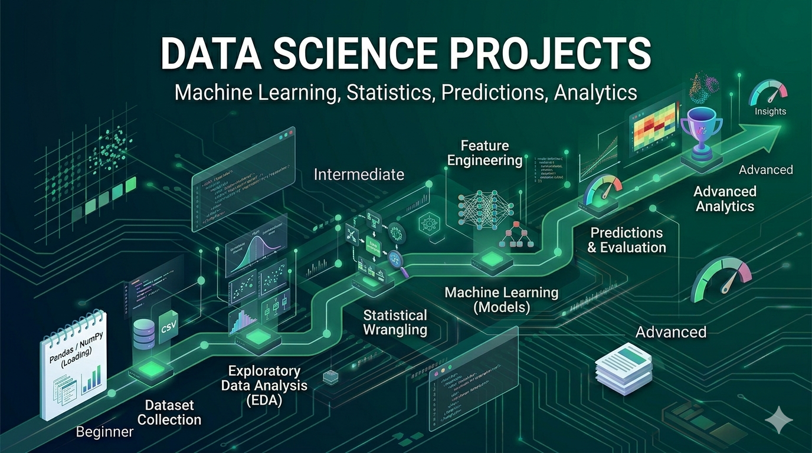

# Data Science Projects

Transform data into actionable insights through analysis, visualization, and machine learning. Data science projects focus on exploratory analysis, predictive modeling, and data-driven decision making.

## What You'll Learn

Data science encompasses:
- **Data Exploration**: Understanding data structure and distributions
- **Data Cleaning**: Handling missing values, outliers, and inconsistencies
- **Statistical Analysis**: Hypothesis testing, correlations, distributions
- **Data Visualization**: Creating meaningful charts and dashboards
- **Machine Learning**: Supervised and unsupervised learning algorithms
- **Model Evaluation**: Metrics, validation, and hyperparameter tuning
- **Storytelling**: Communicating insights effectively
- **Python/R Fundamentals**: Programming for data analysis

---

## Beginner Projects (10 Projects)

Start with foundational data science concepts through hands-on analysis.

| # | Project | Description |
|---|---------|-------------|
| 1 | [Data Cleaning Pipeline](./beginner/01-data-cleaning-pipeline/) | Clean and preprocess raw CSV data |
| 2 | [Basic EDA Notebook](./beginner/02-basic-eda-notebook/) | Perform exploratory data analysis on a dataset |
| 3 | [Linear Regression Model](./beginner/03-linear-regression-model/) | Build a model predicting continuous values |
| 4 | [Classification Model (Iris Dataset)](./beginner/04-classification-iris/) | Create a classifier for iris flower species |
| 5 | [Data Visualization Dashboard](./beginner/05-visualization-dashboard/) | Build interactive charts and visualizations |
| 6 | [Simple Recommendation System](./beginner/06-simple-recommendation/) | Create basic movie or product recommendations |
| 7 | [Text Sentiment Analysis](./beginner/07-text-sentiment-analysis/) | Analyze sentiment in reviews or social media |
| 8 | [Dataset Comparison Tool](./beginner/08-dataset-comparison/) | Compare statistics across multiple datasets |
| 9 | [Feature Importance Analysis](./beginner/09-feature-importance/) | Identify which features matter most in data |
| 10 | [Time Series Basic Forecast](./beginner/10-time-series-forecast/) | Predict future values from historical data |

---

## Intermediate Projects (10 Projects)

Integrate multiple concepts and work with real-world data science patterns.

| # | Project | Description |
|---|---------|-------------|
| 1 | [Customer Segmentation](./intermediate/01-customer-segmentation/) | Cluster customers using unsupervised learning |
| 2 | [Recommendation Engine](./intermediate/02-recommendation-engine/) | Build collaborative filtering recommendations |
| 3 | [NLP Pipeline](./intermediate/03-nlp-pipeline/) | Process text with tokenization and embeddings |
| 4 | [Fraud Detection Model](./intermediate/04-fraud-detection/) | Classify transactions as fraudulent or legitimate |
| 5 | [A/B Testing Analysis](./intermediate/05-ab-testing-analysis/) | Analyze experiment results statistically |
| 6 | [Feature Engineering Pipeline](./intermediate/06-feature-engineering/) | Create and select features for models |
| 7 | [Model Evaluation Framework](./intermediate/07-model-evaluation/) | Compare and validate multiple models |
| 8 | [Data Drift Detection](./intermediate/08-data-drift-detection/) | Monitor data changes over time |
| 9 | [Time Series Forecasting](./intermediate/09-time-series-arima/) | Build ARIMA models for forecasting |
| 10 | [ML Pipeline (End-to-End)](./intermediate/10-ml-pipeline-end-to-end/) | Create complete ML workflow with all steps |

---

## Advanced Projects (10 Projects)

Design and architect complex data science systems with enterprise considerations.

| # | Project | Description |
|---|---------|-------------|
| 1 | [End-to-End ML Platform](./advanced/01-end-to-end-ml-platform/) | Build complete ML platform with versioning and deployment |
| 2 | [Real-Time Prediction System](./advanced/02-realtime-prediction/) | Deploy models serving predictions in real-time |
| 3 | [AutoML Pipeline](./advanced/03-automl-pipeline/) | Build automated machine learning system |
| 4 | [Deep Learning Model](./advanced/04-deep-learning-image-classification/) | Train neural networks for image classification |
| 5 | [NLP Transformer System](./advanced/05-nlp-transformer/) | Build advanced NLP with transformers and embeddings |
| 6 | [Recommendation at Scale](./advanced/06-recommendation-scale/) | Build large-scale recommendation infrastructure |
| 7 | [ML Monitoring System](./advanced/07-ml-monitoring/) | Monitor model performance and detect degradation |
| 8 | [Federated Learning](./advanced/08-federated-learning/) | Implement distributed machine learning |
| 9 | [Explainable AI Tool](./advanced/09-explainable-ai/) | Build interpretable machine learning models |
| 10 | [Multi-Model Ensemble](./advanced/10-ensemble-models/) | Combine multiple models for better predictions |

---

## Learning Path

### Timeline & Progression

**Beginner Phase**: 3-4 weeks
- Learn Python fundamentals for data science
- Understand NumPy, Pandas, and Matplotlib
- Perform basic data exploration and cleaning
- Build first machine learning models

**Intermediate Phase**: 6-8 weeks
- Master scikit-learn and ML algorithms
- Learn feature engineering and selection
- Understand model evaluation and validation
- Work with real-world datasets

**Advanced Phase**: 2-3 months
- Build production ML systems
- Work with deep learning frameworks
- Implement scalable pipelines
- Deploy models and monitor performance

### Recommended Tech Stacks

#### Core Tools

**Python Stack**
- NumPy, Pandas (data manipulation)
- Matplotlib, Seaborn, Plotly (visualization)
- scikit-learn (machine learning)
- TensorFlow, PyTorch (deep learning)
- Jupyter Notebooks (experimentation)

**Complementary Tools**
- Git (version control)
- SQL (database queries)
- Docker (reproducibility)
- MLflow, Weights & Biases (experiment tracking)

### Key Concepts to Master

1. **Statistics**: Distributions, hypothesis testing, correlations
2. **Data Manipulation**: Cleaning, transformation, aggregation
3. **Visualization**: Creating meaningful charts and dashboards
4. **ML Algorithms**: Regression, classification, clustering
5. **Feature Engineering**: Creating and selecting features
6. **Model Evaluation**: Cross-validation, metrics, hyperparameter tuning
7. **Deep Learning**: Neural networks, CNNs, RNNs, Transformers
8. **Deployment**: Model serving, monitoring, A/B testing

---

## Tips for Success

1. **Start with Data Understanding**: Spend time exploring before modeling
2. **Clean Data is Crucial**: Invest in data quality, not just algorithms
3. **Visualize Everything**: Plots reveal insights that statistics miss
4. **Iterate on Features**: Feature engineering often matters more than algorithm choice
5. **Validate Properly**: Use cross-validation and test sets rigorously
6. **Think Like a Business**: Connect models to real-world problems
7. **Document Your Work**: Make your analysis reproducible
8. **Share Your Insights**: Present findings clearly to stakeholders

---

## Common Mistakes to Avoid

- Data leakage in training/test splits
- Ignoring class imbalance in classification
- Over-fitting without proper validation
- Neglecting data quality issues
- Using wrong metrics for the problem
- Not understanding your data before modeling
- Optimizing for accuracy instead of business metrics

---

## Resources

- [Python for Data Analysis (Pandas & NumPy)](https://wesmckinney.com/book/)
- [Scikit-Learn Documentation](https://scikit-learn.org/)
- [Fast.ai Practical Deep Learning](https://www.fast.ai/)
- [Andrew Ng's Machine Learning Course](https://www.coursera.org/learn/machine-learning)
- [Data Science Roadmap](https://roadmap.sh/data-science)
- [Kaggle Competitions](https://www.kaggle.com/competitions)

---

## Real-World Datasets

- [Kaggle Datasets](https://www.kaggle.com/datasets)
- [UCI Machine Learning Repository](https://archive.ics.uci.edu/ml/index.php)
- [Google Dataset Search](https://datasetsearch.research.google.com/)
- [GitHub Awesome Public Datasets](https://github.com/awesomedata/awesome-public-datasets)

---

## Next Steps

1. Install Python, Jupyter, and necessary libraries
2. Choose a beginner project and read its README
3. Explore the dataset before modeling
4. Implement the project step by step
5. Create visualizations to understand results
6. Progress to intermediate projects

**Ready to discover insights in data? Pick a project and start analyzing!**
