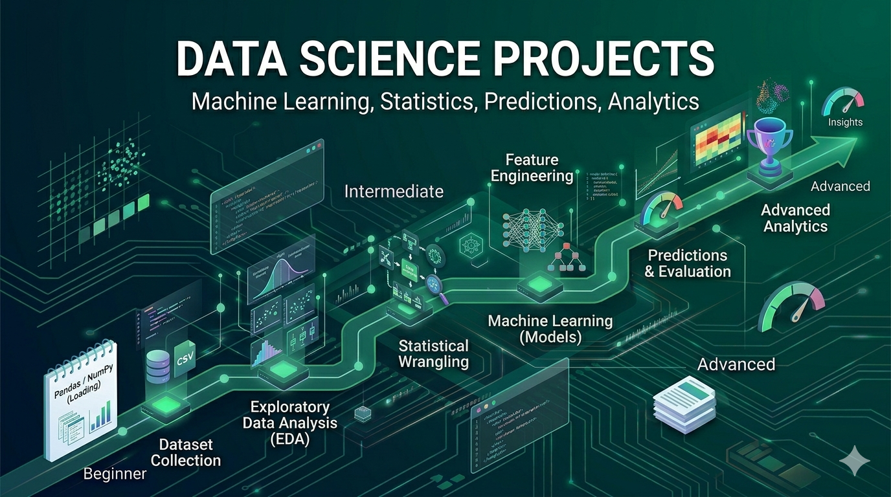

> 🌐 [English](./README.md) · **Português**

# Projetos de Ciência de Dados

Transforme dados brutos em insight e previsão: análise exploratória, raciocínio
estatístico, modelos de machine learning e comunicação clara. São exercícios
guiados — você recebe o *o quê* e o *porquê*, e então escreve o código.

> Cada projeto tem um brief em inglês (`README.md`) e outro em português
> (`README.pt-BR.md`).

## O Que Você Vai Construir

- Notebooks de EDA reprodutíveis e pipelines de limpeza
- Modelos de regressão, classificação e clustering
- Motores de recomendação e pipelines de NLP
- Fluxos de ML de ponta a ponta com avaliação e tuning
- Deep learning e sistemas de ML em produção

## O Que Você Vai Aprender

- **Exploração**: distribuições, correlações, qualidade dos dados
- **Estatística**: testes de hipótese, análise A/B, validação
- **Modelagem**: algoritmos supervisionados e não supervisionados
- **Engenharia de features**: criar e selecionar sinal
- **Avaliação**: métricas, validação cruzada, tuning de hiperparâmetros

## Projetos Iniciantes (10 Projetos)

Conceitos fundamentais de ciência de dados por meio de análise prática.

| # | Projeto | Descrição |
|---|---------|-----------|
| 1 | [Data Cleaning Pipeline](./beginner/01-data-cleaning-csv/) | Limpe e pré-processe dados CSV brutos |
| 2 | [Basic EDA Notebook](./beginner/02-basic-eda-notebook/) | Realize análise exploratória de dados em um dataset |
| 3 | [Linear Regression Model](./beginner/03-linear-regression/) | Construa um modelo que prevê valores contínuos |
| 4 | [Classification Model (Iris Dataset)](./beginner/04-classification-iris/) | Crie um classificador para espécies de flores íris |
| 5 | [Data Visualization Dashboard](./beginner/05-visualization-dashboard/) | Construa gráficos e visualizações interativas |
| 6 | [Simple Recommendation System](./beginner/06-recommendation-system/) | Crie recomendações básicas de filmes ou produtos |
| 7 | [Text Sentiment Analysis](./beginner/07-sentiment-analysis/) | Analise o sentimento em avaliações ou redes sociais |
| 8 | [Dataset Comparison Tool](./beginner/08-dataset-comparison/) | Compare estatísticas entre múltiplos datasets |
| 9 | [Feature Importance Analysis](./beginner/09-feature-importance/) | Identifique quais features mais importam nos dados |
| 10 | [Time Series Basic Forecast](./beginner/10-time-series-forecast/) | Preveja valores futuros a partir de dados históricos |

## Projetos Intermediários (10 Projetos)

Vários conceitos combinados em padrões reais de ciência de dados.

| # | Projeto | Descrição |
|---|---------|-----------|
| 1 | [Customer Segmentation](./intermediate/01-customer-segmentation/) | Agrupe clientes usando aprendizado não supervisionado |
| 2 | [Recommendation Engine](./intermediate/02-recommendation-engine/) | Construa recomendações por filtragem colaborativa |
| 3 | [NLP Pipeline](./intermediate/03-nlp-pipeline/) | Processe texto com tokenização e embeddings |
| 4 | [Fraud Detection Model](./intermediate/04-fraud-detection/) | Classifique transações como fraudulentas ou legítimas |
| 5 | [A/B Testing Analysis](./intermediate/05-ab-testing-tool/) | Analise resultados de experimentos estatisticamente |
| 6 | [Feature Engineering Pipeline](./intermediate/06-feature-engineering/) | Crie e selecione features para modelos |
| 7 | [Model Evaluation Framework](./intermediate/07-model-evaluation/) | Compare e valide múltiplos modelos |
| 8 | [Data Drift Detection](./intermediate/08-data-drift-detection/) | Monitore mudanças nos dados ao longo do tempo |
| 9 | [Time Series Forecasting](./intermediate/09-time-series-arima/) | Construa modelos ARIMA para previsão |
| 10 | [ML Pipeline (End-to-End)](./intermediate/10-ml-pipeline/) | Crie um fluxo de ML completo com todas as etapas |

## Projetos Avançados (10 Projetos)

Arquitete sistemas de ciência de dados complexos com preocupações de nível empresarial.

| # | Projeto | Descrição |
|---|---------|-----------|
| 1 | [End-to-End ML Platform](./advanced/01-end-to-end-ml-platform/) | Construa uma plataforma de ML completa com versionamento e deploy |
| 2 | [Real-Time Prediction System](./advanced/02-real-time-prediction/) | Faça deploy de modelos servindo previsões em tempo real |
| 3 | [AutoML Pipeline](./advanced/03-automl-pipeline/) | Construa um sistema de machine learning automatizado |
| 4 | [Deep Learning Model](./advanced/04-deep-learning-image/) | Treine redes neurais para classificação de imagens |
| 5 | [NLP Transformer System](./advanced/05-nlp-transformer/) | Construa NLP avançado com transformers e embeddings |
| 6 | [Recommendation at Scale](./advanced/06-recommendation-scale/) | Construa infraestrutura de recomendação em larga escala |
| 7 | [ML Monitoring System](./advanced/07-ml-monitoring/) | Monitore o desempenho do modelo e detecte degradação |
| 8 | [Federated Learning](./advanced/08-federated-learning/) | Implemente machine learning distribuído |
| 9 | [Explainable AI Tool](./advanced/09-explainable-ai/) | Construa modelos de machine learning interpretáveis |
| 10 | [Multi-Model Ensemble](./advanced/10-multi-model-ensemble/) | Combine múltiplos modelos para previsões melhores |

## Trilha de Aprendizado

- **Iniciante (3–4 semanas)**: Python para dados, NumPy/Pandas/Matplotlib,
  exploração básica, limpeza e primeiros modelos.
- **Intermediário (6–8 semanas)**: algoritmos do scikit-learn, engenharia de
  features, avaliação e validação em datasets reais.
- **Avançado (2–3 meses)**: ML em produção, deep learning, pipelines
  escaláveis, deploy e monitoramento.

Entenda os dados antes de modelar — limpeza e EDA vêm primeiro.

## Conceitos-Chave

1. **Estatística** — distribuições, testes de hipótese, correlações
2. **Manipulação de dados** — limpeza, transformação, agregação
3. **Visualização** — gráficos e dashboards significativos
4. **Algoritmos de ML** — regressão, classificação, clustering
5. **Engenharia de features** — criar e selecionar features
6. **Avaliação** — validação cruzada, métricas, tuning
7. **Deep learning** — redes neurais, CNNs, RNNs, transformers

## Recursos

- [Python for Data Analysis (McKinney)](https://wesmckinney.com/book/)
- [Documentação do scikit-learn](https://scikit-learn.org/)
- [fast.ai — Deep Learning Prático](https://www.fast.ai/)
- [Datasets do Kaggle](https://www.kaggle.com/datasets)
- [Roadmap de Cientista de Dados](https://roadmap.sh/ai-data-scientist)

## Próximos Passos

1. Instale Python, Jupyter e as bibliotecas principais.
2. Escolha um projeto iniciante e leia o brief até o fim.
3. Explore o dataset antes de modelar.
4. Construa passo a passo e depois tente os desafios extras.

**Escolha um projeto e comece a descobrir insights.**
