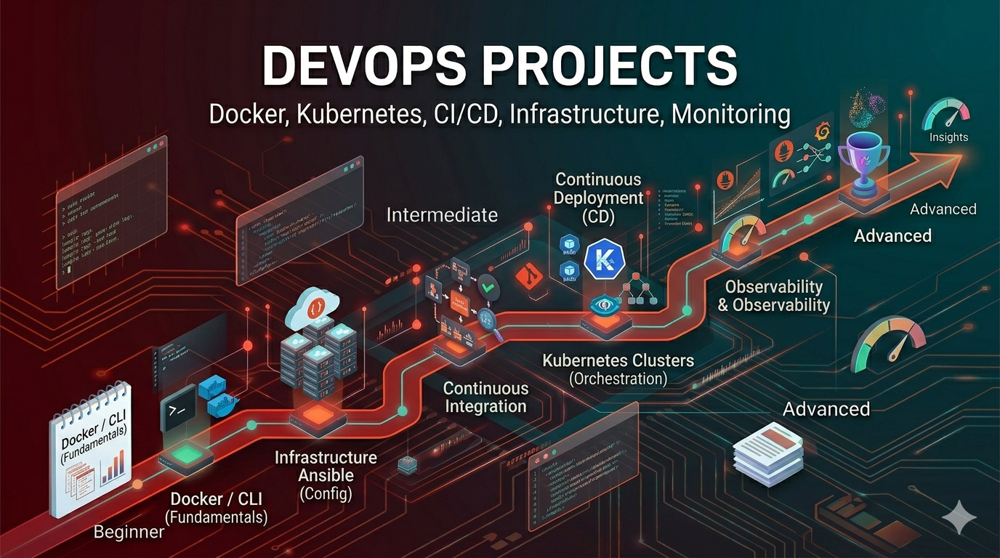

# DevOps Projects

Automate deployments, manage infrastructure, and ensure system reliability. DevOps projects focus on CI/CD pipelines, containerization, orchestration, monitoring, and infrastructure automation.

## What You'll Learn

DevOps encompasses:
- **Version Control**: Git workflows and collaboration
- **CI/CD Pipelines**: Automated testing and deployment
- **Containerization**: Docker and application packaging
- **Orchestration**: Kubernetes and container management
- **Infrastructure as Code**: Automating infrastructure provisioning
- **Monitoring & Observability**: Logs, metrics, and alerting
- **Cloud Platforms**: AWS, GCP, Azure fundamentals
- **Security**: Access control, secrets management
- **Automation**: Scripting and workflow automation

---

## Beginner Projects (10 Projects)

Start with foundational DevOps concepts through practical tasks.

| # | Project | Description |
|---|---------|-------------|
| 1 | [Dockerize a Simple App](./beginner/01-dockerize-app/) | Package an application in a Docker container |
| 2 | [Basic CI Pipeline](./beginner/02-basic-ci-pipeline/) | Set up automated testing on code push |
| 3 | [Environment Config Manager](./beginner/03-environment-config/) | Manage configuration across environments |
| 4 | [Simple Deployment Script](./beginner/04-deployment-script/) | Automate application deployment with scripts |
| 5 | [Log Monitoring Script](./beginner/05-log-monitoring/) | Collect and analyze application logs |
| 6 | [Health Check System](./beginner/06-health-check-system/) | Monitor service health and availability |
| 7 | [Backup Automation](./beginner/07-backup-automation/) | Automate database and file backups |
| 8 | [Basic Nginx Setup](./beginner/08-nginx-setup/) | Configure reverse proxy and web server |
| 9 | [Cron Job Manager](./beginner/09-cron-job-manager/) | Schedule and manage automated tasks |
| 10 | [Service Restart Monitor](./beginner/10-service-monitor/) | Monitor and restart failed services |

---

## Intermediate Projects (10 Projects)

Integrate multiple concepts and work with real-world DevOps patterns.

| # | Project | Description |
|---|---------|-------------|
| 1 | [CI/CD Pipeline with GitHub Actions](./intermediate/01-github-actions-cicd/) | Build complete CI/CD pipeline with GitHub Actions |
| 2 | [Kubernetes Deployment](./intermediate/02-kubernetes-deployment/) | Deploy applications to Kubernetes clusters |
| 3 | [Infrastructure as Code with Terraform](./intermediate/03-terraform-iac/) | Provision infrastructure using code |
| 4 | [Centralized Logging System](./intermediate/04-centralized-logging/) | Set up ELK stack or similar for log aggregation |
| 5 | [Monitoring Stack](./intermediate/05-monitoring-prometheus-grafana/) | Deploy Prometheus and Grafana monitoring |
| 6 | [Blue-Green Deployment](./intermediate/06-blue-green-deployment/) | Implement safe zero-downtime deployments |
| 7 | [Secret Management System](./intermediate/07-secret-management/) | Securely manage and rotate secrets |
| 8 | [Auto-Scaling Setup](./intermediate/08-auto-scaling/) | Configure automatic scaling based on load |
| 9 | [Load Balancing System](./intermediate/09-load-balancing/) | Distribute traffic across multiple servers |
| 10 | [Container Orchestration](./intermediate/10-container-orchestration/) | Manage multiple containers at scale |

---

## Advanced Projects (10 Projects)

Design and architect complex infrastructure with enterprise considerations.

| # | Project | Description |
|---|---------|-------------|
| 1 | [Multi-Cluster Kubernetes Architecture](./advanced/01-multi-cluster-kubernetes/) | Manage Kubernetes across multiple clusters |
| 2 | [GitOps Pipeline](./advanced/02-gitops-pipeline/) | Implement declarative infrastructure management |
| 3 | [Chaos Engineering Setup](./advanced/03-chaos-engineering/) | Test resilience with controlled failures |
| 4 | [Full Observability Platform](./advanced/04-observability-platform/) | Build complete monitoring, logging, and tracing |
| 5 | [Multi-Region Deployment](./advanced/05-multi-region-deployment/) | Deploy applications across geographic regions |
| 6 | [Zero-Downtime Deployment System](./advanced/06-zero-downtime-deployment/) | Implement sophisticated deployment strategies |
| 7 | [Service Mesh Implementation](./advanced/07-service-mesh-istio/) | Deploy Istio for advanced traffic management |
| 8 | [Incident Response Automation](./advanced/08-incident-response/) | Automate incident detection and response |
| 9 | [Cost Monitoring System](./advanced/09-cost-monitoring/) | Track and optimize cloud infrastructure costs |
| 10 | [Platform Engineering Toolkit](./advanced/10-platform-engineering/) | Build internal developer platforms |

---

## Learning Path

### Timeline & Progression

**Beginner Phase**: 2-3 weeks
- Learn Docker fundamentals
- Understand basic CI/CD concepts
- Master command-line tools and scripting
- Deploy simple applications manually

**Intermediate Phase**: 4-6 weeks
- Learn Kubernetes essentials
- Build CI/CD pipelines
- Understand Infrastructure as Code
- Implement monitoring and logging

**Advanced Phase**: 2-3 months
- Design multi-region deployments
- Implement service meshes
- Build internal platforms
- Architect for scalability and reliability

### Recommended Tech Stacks

#### Core Tools

**Containerization**
- Docker (container runtime)
- Docker Compose (multi-container orchestration)
- Container registries (Docker Hub, ECR, GCR)

**Orchestration**
- Kubernetes (container orchestration)
- Helm (Kubernetes package management)

**CI/CD**
- GitHub Actions, GitLab CI, Jenkins
- GitOps tools: ArgoCD, Flux

**Infrastructure**
- Terraform (infrastructure as code)
- Ansible (configuration management)

**Monitoring**
- Prometheus (metrics collection)
- Grafana (visualization)
- ELK Stack (logging)
- Jaeger (tracing)

**Cloud Platforms**
- AWS, GCP, Azure, DigitalOcean

### Key Concepts to Master

1. **Linux & Bash**: Shell scripting and system administration
2. **Networking**: DNS, TCP/IP, load balancing, firewalls
3. **Databases**: Backup, replication, high availability
4. **Security**: Secrets management, access control, encryption
5. **Containerization**: Docker, images, registries
6. **Orchestration**: Kubernetes concepts and operations
7. **CI/CD**: Pipelines, testing automation, deployment
8. **Observability**: Metrics, logs, traces, alerting

---

## Tips for Success

1. **Master Fundamentals**: Learn Linux and Docker before Kubernetes
2. **Automate Everything**: Manual tasks should be rare
3. **Test Infrastructure**: Use Infrastructure as Code and version control
4. **Monitor from Day One**: Don't add monitoring after problems appear
5. **Plan for Failure**: Assume things will fail and design accordingly
6. **Document Runbooks**: Make troubleshooting repeatable
7. **Start Small**: Master simple setups before complex architectures
8. **Security First**: Never compromise on security for convenience

---

## Common Mistakes to Avoid

- Running everything on single servers
- Lack of monitoring and observability
- Manual deployments instead of automation
- No disaster recovery planning
- Hardcoding configuration values
- Ignoring security best practices
- Not testing failover scenarios
- Storing secrets in version control

---

## Resources

- [Docker Documentation](https://docs.docker.com/)
- [Kubernetes Official Tutorial](https://kubernetes.io/docs/tutorials/)
- [Terraform Documentation](https://www.terraform.io/docs)
- [GitHub Actions Documentation](https://docs.github.com/en/actions)
- [DevOps Roadmap](https://roadmap.sh/devops)
- [Linux Academy / A Cloud Guru](https://www.pluralsight.com/)
- [Kubernetes in 100 Seconds](https://www.youtube.com/results?search_query=kubernetes+in+100+seconds)

---

## Real-World Scenarios

- Deploying microservices to Kubernetes
- Setting up CI/CD for rapid releases
- Multi-environment deployments (dev, staging, prod)
- Database backup and recovery procedures
- Infrastructure disaster recovery
- Cost optimization across cloud resources
- Security and compliance automation

---

## Next Steps

1. Install Docker and learn containerization basics
2. Choose a beginner project and read its README
3. Set up a simple local development environment
4. Implement each project step by step
5. Deploy to a cloud platform (even free tier)
6. Progress to intermediate projects

**Ready to automate and scale systems? Pick a project and start building your DevOps skills!**
