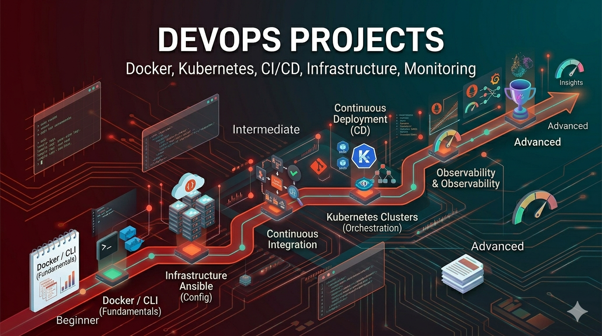

> 🌐 [English](./README.md) · **Português**

# Projetos de DevOps

Automatize a entrega e mantenha os sistemas confiáveis: pipelines de CI/CD,
containers, orquestração, infraestrutura como código e observabilidade. São
exercícios guiados — você recebe o *o quê* e o *porquê*, e então escreve o código.

> Cada projeto tem um brief em inglês (`README.md`) e outro em português
> (`README.pt-BR.md`).

## O Que Você Vai Construir

- Apps em Docker e pipelines de CI
- Deployments em Kubernetes e infraestrutura com Terraform
- Logging centralizado e monitoramento com Prometheus/Grafana
- Sistemas de deploy blue-green, GitOps e zero-downtime
- Service meshes, experimentos de chaos e plataformas internas

## O Que Você Vai Aprender

- **CI/CD**: testes, build e deploy automatizados
- **Containers**: imagens Docker, registries, orquestração
- **IaC**: Terraform, infraestrutura declarativa
- **Observabilidade**: métricas, logs, traces, alertas
- **Confiabilidade**: escalabilidade, failover, resposta a incidentes

## Projetos Iniciantes (10 Projetos)

Conceitos fundamentais de DevOps por meio de tarefas práticas.

| # | Projeto | Descrição |
|---|---------|-----------|
| 1 | [Dockerize a Simple App](./beginner/01-dockerize-simple-app/) | Empacote uma aplicação em um container Docker |
| 2 | [Basic CI Pipeline](./beginner/02-basic-ci/) | Configure testes automatizados no push de código |
| 3 | [Environment Config Manager](./beginner/03-environment-config/) | Gerencie configuração entre ambientes |
| 4 | [Simple Deployment Script](./beginner/04-deployment-script/) | Automatize o deploy da aplicação com scripts |
| 5 | [Log Monitoring Script](./beginner/05-log-monitoring/) | Colete e analise logs da aplicação |
| 6 | [Health Check System](./beginner/06-health-check/) | Monitore a saúde e disponibilidade do serviço |
| 7 | [Backup Automation](./beginner/07-backup-automation/) | Automatize backups de banco de dados e arquivos |
| 8 | [Basic Nginx Setup](./beginner/08-nginx-setup/) | Configure proxy reverso e servidor web |
| 9 | [Cron Job Manager](./beginner/09-cron-manager/) | Agende e gerencie tarefas automatizadas |
| 10 | [Service Restart Monitor](./beginner/10-service-restart/) | Monitore e reinicie serviços com falha |

## Projetos Intermediários (10 Projetos)

Vários conceitos combinados em padrões reais de DevOps.

| # | Projeto | Descrição |
|---|---------|-----------|
| 1 | [CI/CD Pipeline with GitHub Actions](./intermediate/01-cicd-github-actions/) | Construa um pipeline de CI/CD completo com GitHub Actions |
| 2 | [Kubernetes Deployment](./intermediate/02-kubernetes-deployment/) | Faça deploy de aplicações em clusters Kubernetes |
| 3 | [Infrastructure as Code with Terraform](./intermediate/03-terraform-iac/) | Provisione infraestrutura usando código |
| 4 | [Centralized Logging System](./intermediate/04-centralized-logging/) | Configure a stack ELK ou similar para agregação de logs |
| 5 | [Monitoring Stack](./intermediate/05-monitoring-prometheus-grafana/) | Faça deploy de monitoramento com Prometheus e Grafana |
| 6 | [Blue-Green Deployment](./intermediate/06-blue-green-deployment/) | Implemente deploys seguros sem downtime |
| 7 | [Secret Management System](./intermediate/07-secret-management/) | Gerencie e rotacione segredos com segurança |
| 8 | [Auto-Scaling Setup](./intermediate/08-auto-scaling/) | Configure escalabilidade automática com base na carga |
| 9 | [Load Balancing System](./intermediate/09-load-balancing/) | Distribua tráfego entre múltiplos servidores |
| 10 | [Container Orchestration](./intermediate/10-container-orchestration/) | Gerencie múltiplos containers em escala |

## Projetos Avançados (10 Projetos)

Arquitete infraestrutura complexa com preocupações de nível empresarial.

| # | Projeto | Descrição |
|---|---------|-----------|
| 1 | [Multi-Cluster Kubernetes Architecture](./advanced/01-multi-cluster-k8s/) | Gerencie Kubernetes entre múltiplos clusters |
| 2 | [GitOps Pipeline](./advanced/02-gitops-pipeline/) | Implemente gestão de infraestrutura declarativa |
| 3 | [Chaos Engineering Setup](./advanced/03-chaos-engineering/) | Teste resiliência com falhas controladas |
| 4 | [Full Observability Platform](./advanced/04-observability-platform/) | Construa monitoramento, logging e tracing completos |
| 5 | [Multi-Region Deployment](./advanced/05-multi-region-deployment/) | Faça deploy de aplicações entre regiões geográficas |
| 6 | [Zero-Downtime Deployment System](./advanced/06-zero-downtime-deployment/) | Implemente estratégias de deploy sofisticadas |
| 7 | [Service Mesh Implementation](./advanced/07-service-mesh/) | Faça deploy do Istio para gestão avançada de tráfego |
| 8 | [Incident Response Automation](./advanced/08-incident-response/) | Automatize detecção e resposta a incidentes |
| 9 | [Cost Monitoring System](./advanced/09-cost-monitoring/) | Acompanhe e otimize os custos de infraestrutura em nuvem |
| 10 | [Platform Engineering Toolkit](./advanced/10-platform-engineering/) | Construa plataformas internas para desenvolvedores |

## Trilha de Aprendizado

- **Iniciante (2–3 semanas)**: fundamentos de Docker, CI/CD básico, scripting
  em shell, deploys manuais.
- **Intermediário (4–6 semanas)**: Kubernetes, pipelines de CI/CD,
  infraestrutura como código, monitoramento e logging.
- **Avançado (2–3 meses)**: deploys multi-região, service meshes, plataformas
  internas, confiabilidade em escala.

Automatize tudo e adicione observabilidade desde o primeiro dia — nunca deixe para depois.

## Conceitos-Chave

1. **Linux e Bash** — scripting e administração de sistemas
2. **Redes** — DNS, balanceamento de carga, firewalls
3. **Containers** — Docker, imagens, registries
4. **Orquestração** — conceitos e operações de Kubernetes
5. **CI/CD** — pipelines, automação de testes, deploy
6. **IaC** — Terraform, provisionamento declarativo
7. **Observabilidade** — métricas, logs, traces, alertas

## Recursos

- [Documentação do Docker](https://docs.docker.com/)
- [Tutoriais do Kubernetes](https://kubernetes.io/docs/tutorials/)
- [Documentação do Terraform](https://developer.hashicorp.com/terraform/docs)
- [Documentação do GitHub Actions](https://docs.github.com/en/actions)
- [Roadmap de DevOps](https://roadmap.sh/devops)

## Próximos Passos

1. Instale o Docker e aprenda o básico de containerização.
2. Escolha um projeto iniciante e leia o brief até o fim.
3. Configure um ambiente local simples e depois faça deploy em uma nuvem free-tier.
4. Construa passo a passo e depois tente os desafios extras.

**Escolha um projeto e comece a automatizar.**
