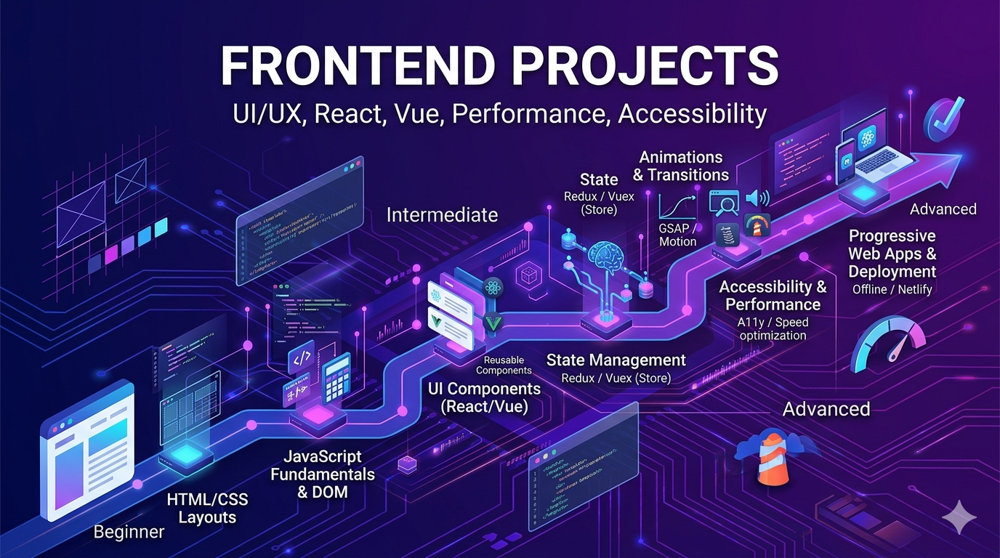

# Frontend Development Projects

Create beautiful, interactive user interfaces that engage users. Frontend projects focus on responsive design, state management, performance optimization, and modern web technologies.

## What You'll Learn

Frontend development encompasses:
- **HTML & CSS**: Semantic markup and responsive design
- **JavaScript**: DOM manipulation, events, and modern ES6+
- **UI Frameworks**: React, Vue, Angular, Svelte
- **State Management**: Managing complex application state
- **Performance**: Optimization, lazy loading, code splitting
- **Accessibility**: Creating inclusive web experiences
- **Testing**: Unit tests, component tests, E2E testing
- **UX/UI Principles**: Design patterns and user experience

---

## Beginner Projects (10 Projects)

Start with foundational frontend concepts through interactive applications.

| # | Project | Description |
|---|---------|-------------|
| 1 | [To-Do List App](./beginner/01-todo-list-app/) | Build an interactive task management application |
| 2 | [Calculator UI](./beginner/02-calculator-ui/) | Create a functional calculator with a clean interface |
| 3 | [Static Portfolio Website](./beginner/03-static-portfolio-website/) | Design a personal portfolio showcasing your work |
| 4 | [Weather App](./beginner/04-weather-app-api/) | Display weather data by consuming an API |
| 5 | [Simple Blog UI](./beginner/05-simple-blog-ui/) | Create a blog display with multiple articles |
| 6 | [Login/Register Forms](./beginner/06-login-register-forms/) | Build authentication forms with validation |
| 7 | [Image Gallery](./beginner/07-image-gallery/) | Create a responsive photo gallery with lightbox |
| 8 | [Notes UI with Local Storage](./beginner/08-notes-ui-local-storage/) | Build a note-taking app persisting to localStorage |
| 9 | [Quiz App](./beginner/09-quiz-app/) | Create an interactive quiz with scoring |
| 10 | [Timer App](./beginner/10-timer-app/) | Build a working timer with start, pause, reset |

---

## Intermediate Projects (10 Projects)

Integrate multiple concepts and work with real-world frontend patterns.

| # | Project | Description |
|---|---------|-------------|
| 1 | [Dashboard with Charts](./intermediate/01-dashboard-with-charts/) | Build an analytics dashboard with data visualization |
| 2 | [Kanban Board with Drag & Drop](./intermediate/02-kanban-board-drag-drop/) | Create a task organizer with draggable cards |
| 3 | [E-Commerce Frontend](./intermediate/03-ecommerce-frontend/) | Build a product catalog with shopping cart |
| 4 | [Chat UI with WebSockets](./intermediate/04-chat-ui-websockets/) | Create a real-time messaging interface |
| 5 | [Admin Panel with CRUD](./intermediate/05-admin-panel-crud/) | Build an interface for managing data |
| 6 | [Markdown Editor](./intermediate/06-markdown-editor/) | Create an editor with live markdown preview |
| 7 | [File Upload UI](./intermediate/07-file-upload-ui/) | Build file upload with progress tracking |
| 8 | [Multi-Step Form](./intermediate/08-multi-step-form/) | Create a wizard-style form with validation |
| 9 | [Theme Switcher App](./intermediate/09-theme-switcher-app/) | Implement dark/light theme switching with persistence |
| 10 | [Real-Time Notifications UI](./intermediate/10-notifications-ui/) | Display push notifications and alerts |

---

## Advanced Projects (10 Projects)

Design and architect complex frontend systems with enterprise considerations.

| # | Project | Description |
|---|---------|-------------|
| 1 | [Microfrontend Architecture](./advanced/01-microfrontend-architecture/) | Build applications composed of multiple independent modules |
| 2 | [Real-Time Collaborative Editor](./advanced/02-collaborative-editor/) | Create a Google Docs-like collaborative editing interface |
| 3 | [Design System & Component Library](./advanced/03-design-system-components/) | Build a comprehensive reusable component library |
| 4 | [Offline-First PWA](./advanced/04-offline-first-pwa/) | Create a Progressive Web App working offline |
| 5 | [Video Streaming UI](./advanced/05-video-streaming-ui/) | Build a Netflix-like video platform interface |
| 6 | [Performance-Optimized Large App](./advanced/06-performance-optimized-app/) | Design applications handling millions of data points |
| 7 | [Accessibility-First UI System](./advanced/07-accessibility-first-ui/) | Build interfaces meeting WCAG 2.1 standards |
| 8 | [Visual Page Builder](./advanced/08-visual-page-builder/) | Create a drag-and-drop page builder interface |
| 9 | [Data-Heavy Dashboard](./advanced/09-data-heavy-dashboard/) | Build dashboards with virtualization and optimization |
| 10 | [Frontend Observability Tool](./advanced/10-frontend-observability/) | Create monitoring and analytics for frontend performance |

---

## Learning Path

### Timeline & Progression

**Beginner Phase**: 2-4 weeks
- Master HTML, CSS, and vanilla JavaScript
- Understand DOM manipulation and events
- Learn responsive design principles
- Build static and interactive pages

**Intermediate Phase**: 4-8 weeks
- Learn a modern framework (React, Vue, or Angular)
- Implement component-based architecture
- Handle state management
- Integrate with backend APIs

**Advanced Phase**: 2-3 months
- Build scalable applications
- Optimize performance
- Implement advanced patterns (microfrontends, etc.)
- Master accessibility and testing

### Recommended Tech Stacks

#### Popular Frameworks

**React Ecosystem**
- React, Next.js
- Redux, Context API, Zustand
- Tailwind CSS, Material UI

**Vue Ecosystem**
- Vue 3, Nuxt
- Pinia, Vuex
- Tailwind CSS, Vuetify

**Angular Ecosystem**
- Angular, NX
- RxJS, NgRx
- Angular Material

**Lightweight Options**
- Svelte, SvelteKit
- Astro
- Plain JavaScript + Web Components

### Key Concepts to Master

1. **Core Technologies**: HTML5, CSS3, JavaScript ES6+
2. **Responsive Design**: Mobile-first, media queries, flexbox/grid
3. **Components**: Building reusable, composable UI elements
4. **State Management**: Managing application state efficiently
5. **APIs**: Fetching data, HTTP requests, WebSockets
6. **Performance**: Code splitting, lazy loading, optimization
7. **Testing**: Unit tests, component tests, E2E testing
8. **Accessibility**: ARIA labels, keyboard navigation, screen readers

---

## Tips for Success

1. **Start with Fundamentals**: Master vanilla JavaScript before frameworks
2. **Build Responsive First**: Design mobile-first from the start
3. **Focus on UX**: User experience matters more than technical complexity
4. **Test Early**: Write tests as you build, not after
5. **Optimize Performance**: Monitor and improve metrics continuously
6. **Keep Accessibility in Mind**: Build inclusive interfaces from day one
7. **Build Portfolio Projects**: Showcase your best work publicly

---

## Resources

- [MDN Web Docs](https://developer.mozilla.org/)
- [CSS-Tricks](https://css-tricks.com/)
- [Frontend Roadmap](https://roadmap.sh/frontend)
- [Web Design Best Practices](https://www.smashingmagazine.com/)
- [Accessibility Guidelines](https://www.w3.org/WAI/WCAG21/quickref/)
- [Performance Optimization](https://web.dev/performance/)

---

## Common Mistakes to Avoid

- Skipping CSS and jumping to frameworks
- Over-complicating state management early
- Ignoring accessibility requirements
- Not testing responsive designs
- Neglecting performance optimization
- Building without considering users

---

## Next Steps

1. Choose a beginner project and read its README
2. Set up your development environment with your preferred tools
3. Build the project, focusing on user experience
4. Add your own creative touches
5. Progress to intermediate projects when ready

**Ready to build beautiful interfaces? Pick a project and start coding!**
