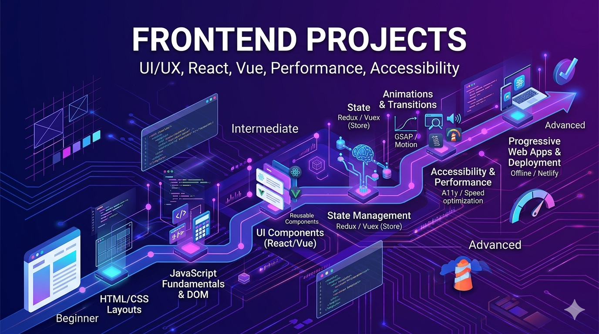

> 🌐 **English** · [Português](./README.pt-BR.md)

# Frontend Development Projects

Build interfaces people actually enjoy using: responsive layouts, real-time
UIs, accessible components, and performant single-page apps. These are guided
exercises — you get the *what* and the *why*, then you write the code.

> Every project has both an English (`README.md`) and a Portuguese
> (`README.pt-BR.md`) brief.

## What You'll Build

- Interactive apps with clean, component-based structure
- Real-time interfaces powered by WebSockets
- Reusable design systems and component libraries
- Offline-first PWAs and performance-optimized dashboards
- Accessible UIs that meet WCAG standards

## What You'll Learn

- **Core web**: semantic HTML, modern CSS, ES6+ JavaScript
- **Frameworks**: component models in React, Vue, Angular, or Svelte
- **State**: local, global, and server state management
- **Performance**: code splitting, lazy loading, virtualization
- **Accessibility**: ARIA, keyboard navigation, screen readers

## Beginner Projects (10 Projects)

Foundational frontend concepts through interactive apps.

| # | Project | Description |
|---|---------|-------------|
| 1 | [To-Do List App](./beginner/01-todo-list-app/) | Build an interactive task management application |
| 2 | [Calculator UI](./beginner/02-calculator-ui/) | Create a functional calculator with a clean interface |
| 3 | [Static Portfolio Website](./beginner/03-static-portfolio/) | Design a personal portfolio showcasing your work |
| 4 | [Weather App](./beginner/04-weather-app/) | Display weather data by consuming an API |
| 5 | [Simple Blog UI](./beginner/05-simple-blog-ui/) | Create a blog display with multiple articles |
| 6 | [Login/Register Forms](./beginner/06-login-register-forms/) | Build authentication forms with validation |
| 7 | [Image Gallery](./beginner/07-image-gallery/) | Create a responsive photo gallery with lightbox |
| 8 | [Notes UI with Local Storage](./beginner/08-notes-ui/) | Build a note-taking app persisting to localStorage |
| 9 | [Quiz App](./beginner/09-quiz-app/) | Create an interactive quiz with scoring |
| 10 | [Timer App](./beginner/10-timer-app/) | Build a working timer with start, pause, reset |

## Intermediate Projects (10 Projects)

Multiple concepts combined into real-world frontend patterns.

| # | Project | Description |
|---|---------|-------------|
| 1 | [Dashboard with Charts](./intermediate/01-analytics-dashboard/) | Build an analytics dashboard with data visualization |
| 2 | [Kanban Board with Drag & Drop](./intermediate/02-kanban-board/) | Create a task organizer with draggable cards |
| 3 | [E-Commerce Frontend](./intermediate/03-ecommerce-frontend/) | Build a product catalog with shopping cart |
| 4 | [Chat UI with WebSockets](./intermediate/04-chat-ui/) | Create a real-time messaging interface |
| 5 | [Admin Panel with CRUD](./intermediate/05-admin-panel/) | Build an interface for managing data |
| 6 | [Markdown Editor](./intermediate/06-markdown-editor/) | Create an editor with live markdown preview |
| 7 | [File Upload UI](./intermediate/07-file-upload-ui/) | Build file upload with progress tracking |
| 8 | [Multi-Step Form](./intermediate/08-multi-step-form/) | Create a wizard-style form with validation |
| 9 | [Theme Switcher App](./intermediate/09-theme-switcher/) | Implement dark/light theme switching with persistence |
| 10 | [Real-Time Notifications UI](./intermediate/10-real-time-notifications/) | Display push notifications and alerts |

## Advanced Projects (10 Projects)

Architect complex frontend systems with enterprise-grade concerns.

| # | Project | Description |
|---|---------|-------------|
| 1 | [Microfrontend Architecture](./advanced/01-microfrontend-architecture/) | Build applications composed of multiple independent modules |
| 2 | [Real-Time Collaborative Editor](./advanced/02-collaborative-editor/) | Create a Google Docs-like collaborative editing interface |
| 3 | [Design System & Component Library](./advanced/03-design-system/) | Build a comprehensive reusable component library |
| 4 | [Offline-First PWA](./advanced/04-offline-first-pwa/) | Create a Progressive Web App working offline |
| 5 | [Video Streaming UI](./advanced/05-streaming-ui/) | Build a Netflix-like video platform interface |
| 6 | [Performance-Optimized Large App](./advanced/06-performance-optimized-app/) | Design applications handling millions of data points |
| 7 | [Accessibility-First UI System](./advanced/07-accessibility-ui/) | Build interfaces meeting WCAG 2.1 standards |
| 8 | [Visual Page Builder](./advanced/08-visual-page-builder/) | Create a drag-and-drop page builder interface |
| 9 | [Data-Heavy Dashboard](./advanced/09-data-heavy-dashboard/) | Build dashboards with virtualization and optimization |
| 10 | [Frontend Observability Tool](./advanced/10-observability-tool/) | Create monitoring and analytics for frontend performance |

## Learning Path

- **Beginner (2–4 weeks)**: HTML, CSS, vanilla JavaScript, DOM events,
  responsive design.
- **Intermediate (4–8 weeks)**: a modern framework, component architecture,
  state management, API integration.
- **Advanced (2–3 months)**: scalable apps, performance optimization, advanced
  patterns, accessibility, and testing.

Build responsive and accessible from day one — don't bolt it on later.

## Key Concepts

1. **Core technologies** — HTML5, CSS3, JavaScript ES6+
2. **Responsive design** — mobile-first, flexbox, grid
3. **Components** — reusable, composable UI elements
4. **State management** — local vs. global vs. server state
5. **Data** — fetch, HTTP, WebSockets
6. **Performance** — code splitting, lazy loading
7. **Accessibility** — ARIA, keyboard, screen readers

## Resources

- [MDN Web Docs](https://developer.mozilla.org/)
- [CSS-Tricks](https://css-tricks.com/)
- [web.dev — Performance](https://web.dev/performance/)
- [WCAG 2.1 Quick Reference](https://www.w3.org/WAI/WCAG21/quickref/)
- [Frontend Developer Roadmap](https://roadmap.sh/frontend)

## Next Steps

1. Pick a beginner project and read its brief end to end.
2. Set up your tooling with whatever framework you prefer.
3. Build it milestone by milestone, focusing on UX.
4. Check the Definition of Done, then attempt the stretch goals.

**Pick a project and start building beautiful interfaces.**
