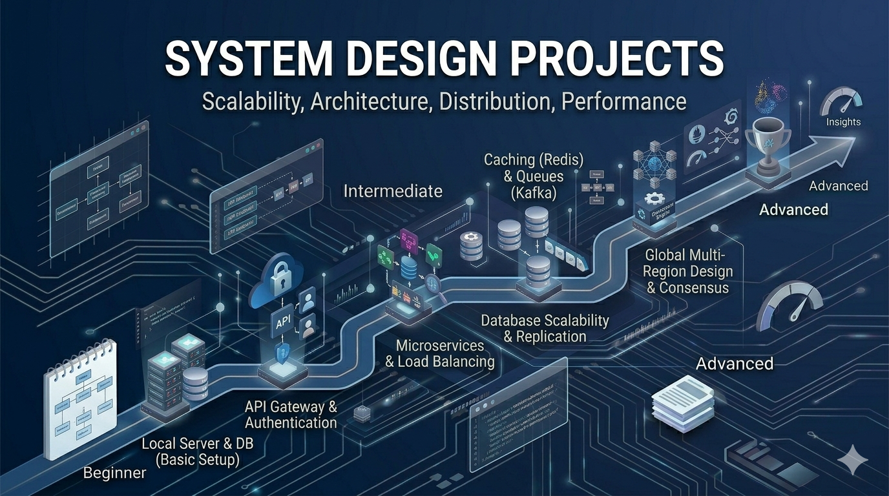

# System Design Projects

Design large-scale distributed systems. System design projects focus on scalability, reliability, performance, and architectural patterns that power real-world applications at scale.

## What You'll Learn

System design encompasses:
- **Scalability**: Handling growth in users and data
- **Load Balancing**: Distributing traffic efficiently
- **Caching**: Improving performance with strategic caching
- **Databases**: SQL vs NoSQL, replication, sharding
- **Messaging Queues**: Asynchronous communication
- **Microservices**: Breaking monoliths into services
- **Consistency Models**: CAP theorem, ACID, eventual consistency
- **APIs**: RESTful and RPC-style architectures
- **Security**: Authentication, authorization, encryption
- **Monitoring**: Observability at scale

---

## Beginner Projects (10 Projects)

Start with foundational system design concepts through focused problems.

| # | Project | Description |
|---|---------|-------------|
| 1 | [Design URL Shortener](./beginner/01-design-url-shortener/) | Create a system that shortens long URLs |
| 2 | [Design Chat System](./beginner/02-design-chat-system/) | Architect a messaging platform for users |
| 3 | [Design File Storage System](./beginner/03-design-file-storage/) | Build infrastructure for storing and serving files |
| 4 | [Design Notification System](./beginner/04-design-notification-system/) | Create a system sending notifications to users |
| 5 | [Design Login System](./beginner/05-design-login-system/) | Architect secure user authentication |
| 6 | [Design Rate Limiter](./beginner/06-design-rate-limiter/) | Prevent abuse by limiting request rates |
| 7 | [Design Cache System](./beginner/07-design-cache-system/) | Build an efficient caching layer |
| 8 | [Design Task Scheduler](./beginner/08-design-task-scheduler/) | Create a system for scheduling and running tasks |
| 9 | [Design Logging System](./beginner/09-design-logging-system/) | Build infrastructure for application logging |
| 10 | [Design Metrics System](./beginner/10-design-metrics-system/) | Create systems for collecting and aggregating metrics |

---

## Intermediate Projects (10 Projects)

Integrate multiple concepts and work with real-world design patterns.

| # | Project | Description |
|---|---------|-------------|
| 1 | [Design Scalable E-Commerce System](./intermediate/01-design-ecommerce/) | Architecture for online shopping platform |
| 2 | [Design Video Streaming System](./intermediate/02-design-video-streaming/) | Infrastructure for video delivery at scale |
| 3 | [Design Ride-Sharing System](./intermediate/03-design-ride-sharing/) | System design for Uber-like platform |
| 4 | [Design Social Media Feed](./intermediate/04-design-social-feed/) | Architecture for personalized content feeds |
| 5 | [Design Search Engine](./intermediate/05-design-search-engine/) | System for full-text search and ranking |
| 6 | [Design Messaging Queue](./intermediate/06-design-messaging-queue/) | Build asynchronous message processing |
| 7 | [Design API Gateway](./intermediate/07-design-api-gateway/) | Create routing and management layer |
| 8 | [Design Recommendation System](./intermediate/08-design-recommendations/) | System suggesting relevant content to users |
| 9 | [Design Analytics System](./intermediate/09-design-analytics-system/) | Infrastructure for data collection and analysis |
| 10 | [Design CDN](./intermediate/10-design-cdn/) | Content delivery network for global distribution |

---

## Advanced Projects (10 Projects)

Design and architect systems handling global scale with enterprise considerations.

| # | Project | Description |
|---|---------|-------------|
| 1 | [Design Netflix-Like System](./advanced/01-design-netflix/) | Architecture for a global video streaming platform |
| 2 | [Design Uber-Like System](./advanced/02-design-uber/) | Real-time matching and dispatch at massive scale |
| 3 | [Design WhatsApp-Like System](./advanced/03-design-whatsapp/) | Global messaging platform with billions of users |
| 4 | [Design YouTube System](./advanced/04-design-youtube/) | Video platform supporting billions of views |
| 5 | [Design Amazon System](./advanced/05-design-amazon/) | E-commerce at global scale with logistics |
| 6 | [Design Distributed Database](./advanced/06-design-distributed-database/) | Database system spanning multiple regions |
| 7 | [Design Global Load Balancer](./advanced/07-design-global-load-balancer/) | Geographic routing and traffic management |
| 8 | [Design Real-Time Collaboration System](./advanced/08-design-collaboration/) | Google Docs-like concurrent editing |
| 9 | [Design High-Frequency Trading System](./advanced/09-design-hft-system/) | Ultra-low latency trading infrastructure |
| 10 | [Design Multi-Region Architecture](./advanced/10-design-multi-region/) | System design for global fault tolerance |

---

## Learning Path

### Timeline & Progression

**Beginner Phase**: 3-4 weeks
- Learn basic system design vocabulary
- Understand trade-offs (scalability vs consistency)
- Study single-server limitations
- Master fundamental components (databases, caching)

**Intermediate Phase**: 6-8 weeks
- Design medium-scale systems (millions of users/requests)
- Learn microservices architecture
- Understand data consistency models
- Study real-world systems from companies

**Advanced Phase**: 2-3 months
- Design systems at planetary scale
- Handle complex trade-offs
- Learn from industry leaders' architectures
- Solve novel problems without templates

### Key System Design Components

#### Databases
- **SQL**: ACID properties, normalized schemas
- **NoSQL**: Document stores, key-value, wide columns
- **Replication**: Master-slave, master-master
- **Sharding**: Horizontal partitioning strategies
- **Indexing**: Query optimization techniques

#### Caching
- **In-Memory**: Redis, Memcached
- **Cache Invalidation**: TTL, LRU, event-based
- **Cache Patterns**: Write-through, write-back, write-around
- **Distributed Caching**: Multi-node consistency

#### Communication
- **Synchronous**: REST, gRPC, WebSockets
- **Asynchronous**: Message queues, pub-sub, event streaming
- **Protocols**: HTTP, TCP, UDP
- **Service Discovery**: Finding available services

#### Scalability Patterns
- **Load Balancing**: Round-robin, least-connections, consistent hashing
- **Database Scaling**: Read replicas, sharding, federated databases
- **Service Scaling**: Horizontal scaling, auto-scaling
- **API Scaling**: Rate limiting, caching, compression

### Recommended Learning Resources

#### Concept Deep Dives
1. **Databases**
   - SQL vs NoSQL trade-offs
   - ACID vs BASE consistency
   - Replication and sharding strategies

2. **Caching**
   - Cache invalidation patterns
   - Distributed cache challenges
   - Cache warming strategies

3. **Load Balancing**
   - Algorithm selection
   - Sticky sessions vs stateless
   - Geographic distribution

4. **Messaging**
   - At-least-once vs exactly-once delivery
   - Message ordering guarantees
   - Dead letter queues

---

## Tips for Success

1. **Understand the Problem First**: Ask clarifying questions before designing
2. **Start Simple**: Begin with a basic design, then iterate
3. **Know Your Trade-Offs**: Every choice has pros and cons
4. **Learn from the Real World**: Study how companies like Netflix, Google, Amazon design systems
5. **Think About Failure**: Design for unavoidable failures
6. **Use Standardized Patterns**: Don't reinvent the wheel
7. **Get Feedback**: Discuss your design with others
8. **Practice Regularly**: System design is a skill that improves with practice

---

## Common Mistakes to Avoid

- Over-designing for scale before validating demand
- Ignoring single points of failure
- Not considering network reliability
- Underestimating consistency requirements
- Premature optimization of the wrong bottleneck
- Designing without understanding constraints
- Choosing technologies without trade-off analysis
- Forgetting about operational complexity

---

## Resources

- [System Design Primer](https://github.com/donnemartin/system-design-primer)
- [Designing Data-Intensive Applications (Book)](https://dataintensive.io/)
- [High Scalability Blog](http://highscalability.com/)
- [Papers We Love](https://paperswelove.org/)
- [Grokking System Design Interview](https://www.educative.io/courses/grokking-the-system-design-interview)
- [System Design Interview Course](https://www.youtube.com/playlist?list=PLjQV3hketV2aSqfsJQSac_NycAyxmHTe)

---

## Real-World System Studies

- How Netflix handles billions of streams
- How WhatsApp manages message delivery
- How YouTube processes video uploads
- How Amazon scales e-commerce
- How Google's search infrastructure works
- How Uber matches riders and drivers
- How Discord maintains low latency at scale

---

## Key Concepts Checklist

- Understand horizontal vs vertical scaling
- Know when to use SQL vs NoSQL
- Understand CAP theorem
- Know common load balancing algorithms
- Understand database replication
- Know cache invalidation strategies
- Understand eventual consistency
- Know microservices communication patterns

---

## Next Steps

1. Read "Designing Data-Intensive Applications" foundations
2. Choose a beginner project and work through it
3. Draw architecture diagrams for your designs
4. Present to others and get feedback
5. Study real company architectures online
6. Progress to intermediate projects

**Ready to architect at scale? Pick a project and start thinking about complex systems!**
