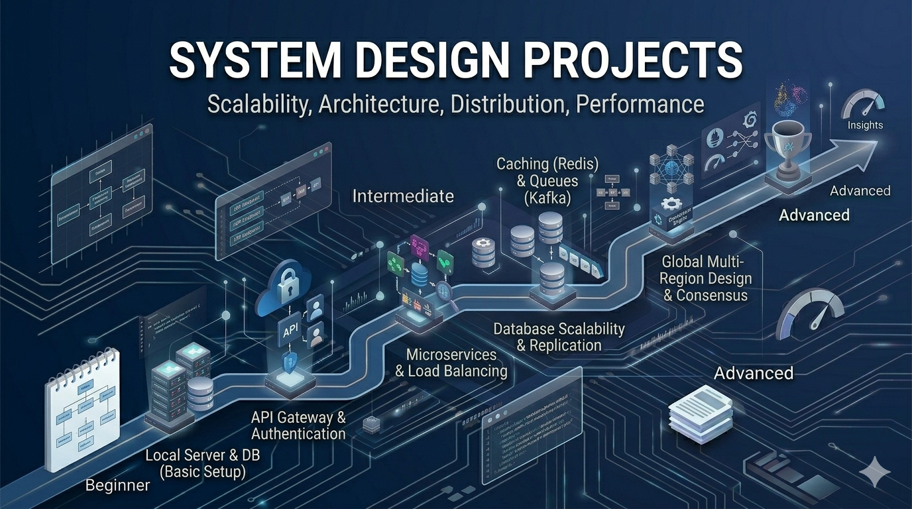

> 🌐 **English** · [Português](./README.pt-BR.md)

# System Design Projects

Design large-scale distributed systems: scalability, reliability, and the
architectural trade-offs behind real products. These are guided exercises —
you get the *what* and the *why*, then you produce the design and reasoning.

> Every project has both an English (`README.md`) and a Portuguese
> (`README.pt-BR.md`) brief.

## What You'll Build

- Component designs for URL shorteners, chat, and rate limiters
- Architectures for e-commerce, streaming, and social feeds
- Blueprints for planet-scale systems (Netflix, Uber, WhatsApp)
- Distributed databases and global load balancers
- Reasoned trade-off documents, not just diagrams

## What You'll Learn

- **Scalability**: horizontal scaling, sharding, partitioning
- **Consistency**: CAP theorem, ACID vs. BASE, replication
- **Caching**: strategies, invalidation, distributed caches
- **Communication**: sync vs. async, queues, pub/sub
- **Trade-offs**: reasoning about failure, latency, and cost

## Beginner Projects (10 Projects)

Foundational system design concepts through focused problems.

| # | Project | Description |
|---|---------|-------------|
| 1 | [Design URL Shortener](./beginner/01-url-shortener/) | Create a system that shortens long URLs |
| 2 | [Design Chat System](./beginner/02-chat-system/) | Architect a messaging platform for users |
| 3 | [Design File Storage System](./beginner/03-file-storage/) | Build infrastructure for storing and serving files |
| 4 | [Design Notification System](./beginner/04-notification-system/) | Create a system sending notifications to users |
| 5 | [Design Login System](./beginner/05-login-system/) | Architect secure user authentication |
| 6 | [Design Rate Limiter](./beginner/06-rate-limiter/) | Prevent abuse by limiting request rates |
| 7 | [Design Cache System](./beginner/07-cache-system/) | Build an efficient caching layer |
| 8 | [Design Task Scheduler](./beginner/08-task-scheduler/) | Create a system for scheduling and running tasks |
| 9 | [Design Logging System](./beginner/09-logging-system/) | Build infrastructure for application logging |
| 10 | [Design Metrics System](./beginner/10-metrics-system/) | Create systems for collecting and aggregating metrics |

## Intermediate Projects (10 Projects)

Multiple concepts combined into real-world design patterns.

| # | Project | Description |
|---|---------|-------------|
| 1 | [Design Scalable E-Commerce System](./intermediate/01-scalable-ecommerce/) | Architecture for online shopping platform |
| 2 | [Design Video Streaming System](./intermediate/02-video-streaming/) | Infrastructure for video delivery at scale |
| 3 | [Design Ride-Sharing System](./intermediate/03-ride-sharing/) | System design for Uber-like platform |
| 4 | [Design Social Media Feed](./intermediate/04-social-feed/) | Architecture for personalized content feeds |
| 5 | [Design Search Engine](./intermediate/05-search-engine/) | System for full-text search and ranking |
| 6 | [Design Messaging Queue](./intermediate/06-messaging-queue/) | Build asynchronous message processing |
| 7 | [Design API Gateway](./intermediate/07-api-gateway/) | Create routing and management layer |
| 8 | [Design Recommendation System](./intermediate/08-recommendation-system/) | System suggesting relevant content to users |
| 9 | [Design Analytics System](./intermediate/09-analytics-system/) | Infrastructure for data collection and analysis |
| 10 | [Design CDN](./intermediate/10-cdn/) | Content delivery network for global distribution |

## Advanced Projects (10 Projects)

Architect systems handling global scale with enterprise-grade concerns.

| # | Project | Description |
|---|---------|-------------|
| 1 | [Design Netflix-Like System](./advanced/01-netflix-system/) | Architecture for a global video streaming platform |
| 2 | [Design Uber-Like System](./advanced/02-uber-system/) | Real-time matching and dispatch at massive scale |
| 3 | [Design WhatsApp-Like System](./advanced/03-whatsapp-system/) | Global messaging platform with billions of users |
| 4 | [Design YouTube System](./advanced/04-youtube-system/) | Video platform supporting billions of views |
| 5 | [Design Amazon System](./advanced/05-amazon-system/) | E-commerce at global scale with logistics |
| 6 | [Design Distributed Database](./advanced/06-distributed-database/) | Database system spanning multiple regions |
| 7 | [Design Global Load Balancer](./advanced/07-global-load-balancer/) | Geographic routing and traffic management |
| 8 | [Design Real-Time Collaboration System](./advanced/08-collaboration-system/) | Google Docs-like concurrent editing |
| 9 | [Design High-Frequency Trading System](./advanced/09-hft-system/) | Ultra-low latency trading infrastructure |
| 10 | [Design Multi-Region Architecture](./advanced/10-multi-region-architecture/) | System design for global fault tolerance |

## Learning Path

- **Beginner (3–4 weeks)**: core vocabulary, single-server limits, fundamental
  components (databases, caching), basic trade-offs.
- **Intermediate (6–8 weeks)**: medium-scale systems, microservices,
  consistency models, real-world architectures.
- **Advanced (2–3 months)**: planet-scale design, complex trade-offs, novel
  problems without templates.

Start simple, then iterate — always state your assumptions and trade-offs.

## Key Concepts

1. **Scaling** — horizontal vs. vertical, auto-scaling
2. **Databases** — SQL vs. NoSQL, replication, sharding
3. **Caching** — patterns and invalidation strategies
4. **Load balancing** — algorithms, sticky vs. stateless
5. **Consistency** — CAP theorem, eventual consistency
6. **Messaging** — delivery guarantees, ordering, DLQs
7. **Resilience** — single points of failure, failover

## Resources

- [System Design Primer](https://github.com/donnemartin/system-design-primer)
- [Designing Data-Intensive Applications](https://dataintensive.io/)
- [High Scalability Blog](http://highscalability.com/)
- [Papers We Love](https://paperswelove.org/)
- [Software Design & Architecture Roadmap](https://roadmap.sh/software-design-architecture)

## Next Steps

1. Read the foundations of "Designing Data-Intensive Applications".
2. Pick a beginner project and read its brief end to end.
3. Draw architecture diagrams and document your trade-offs.
4. Present your design for feedback, then attempt the stretch goals.

**Pick a project and start architecting at scale.**
